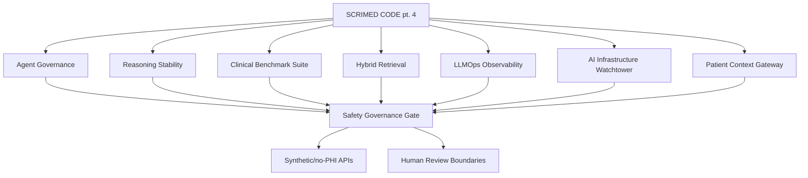

# SCRIMED CODE pt. 4 Implementation

SCRIMED CODE pt. 4 extends SCRIMED with repo-native TypeScript/Next.js infrastructure for agent governance, reasoning stability, clinical benchmarking, hybrid retrieval, LLMOps observability, AI infrastructure strategy, and patient context continuity.

## What Changed

- Added SCRIMED Agent Governance Control Plane
- Added SCRIMED Reasoning Stability Layer
- Added SCRIMED Clinical Benchmark Suite
- Added SCRIMED Hybrid Retrieval Engine
- Added SCRIMED LLMOps Observability Layer
- Added SCRIMED AI Infrastructure Watchtower
- Added SCRIMED Patient Context Gateway
- Added navigation entries, API routes, brief routes, docs, and smoke checks

## Why It Matters

SCRIMED CODE pt. 4 turns recent strategy into measurable, governed, no-PHI infrastructure. The build moves SCRIMED further away from chatbot behavior and toward a healthcare intelligence operating system with agent policies, evidence-first retrieval, benchmark discipline, traceability, and strategic infrastructure awareness.

## Architecture

## Safety Boundaries

- No PHI
- No autonomous clinical care
- No diagnosis, treatment, or prescribing
- No EHR writeback
- No payer submission
- No production deploy claims
- No certification claims
- No customer go-live claims

## Validation Commands

- `npm run smoke:scrimed-agent-governance`
- `npm run smoke:scrimed-reasoning-stability`
- `npm run smoke:scrimed-clinical-benchmark-suite`
- `npm run smoke:scrimed-hybrid-retrieval`
- `npm run smoke:scrimed-llmops-observability`
- `npm run smoke:scrimed-ai-infrastructure-watchtower`
- `npm run smoke:scrimed-patient-context-gateway`
- `npm run smoke:scrimed-code-pt-4`
- `npm run typecheck`
- `npm run lint`
- `npm run test:nonsecret`
- `npm run build`
- `node scripts/check-generated-integrity.mjs`
- `git diff --check`

## Disclaimer

SCRIMED CODE pt. 4 is readiness infrastructure only. It does not claim HIPAA compliance, SOC 2 readiness completion, FDA clearance, ONC certification, clinical validation, production deployment approval, or customer go-live readiness.
