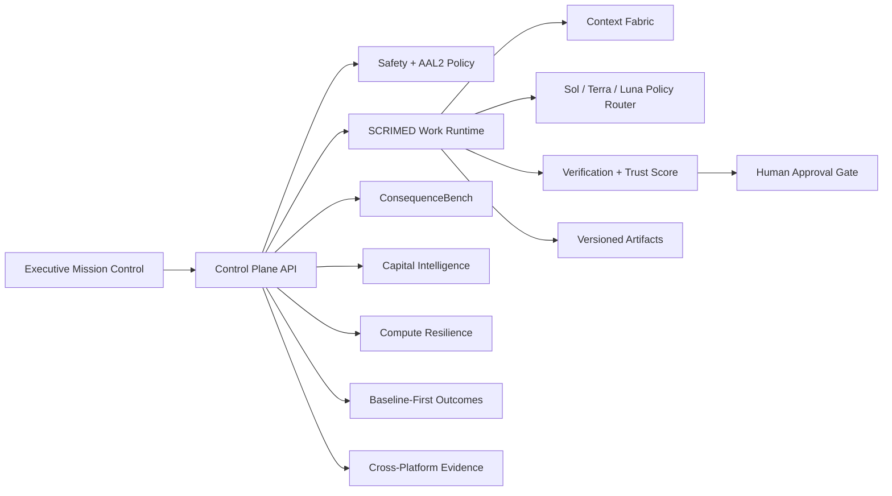

# SCRIMED Intelligence Control Plane

SCRIMED Intelligence Control Plane is the executive mission-control facade over SCRIMED Work, Context Fabric, model policy, verification, ConsequenceBench, artifacts, Capital Intelligence, voice simulation, Compute Resilience, learning proposals, Outcome Intelligence, and audit evidence.

## Architecture



SCRIMED Work remains the only session and mutation authority. Every control-plane POST reuses its AAL2, tenant RBAC/RLS, idempotency, durable-store, approval, cancellation, rollback, and audit controls.

The Approval Achievement layer records dependency, evidence, owner, expiry, authority, safe workaround, and commercial unlock metadata. One automated no-PHI engineering gate is achieved for the dated source evidence; all human, legal, privacy, clinical, regulatory, assurance, buyer, and production approvals remain pending their authorized reviewers.

The Cross-Platform Evidence layer reconciles dated no-secret observations across GitHub, Vercel, Supabase, Wix, and Figma. Drift blocks production promotion; a provider's healthy status never substitutes for source provenance, migration parity, public-claims authorization, or human release approval.

## Safety Boundary

Synthetic and de-identified fixtures only. No live PHI, autonomous diagnosis, treatment, prescribing, final imaging interpretation, EHR writeback, payer submission, investor outreach, financing negotiation, securities representation, production deployment, regulatory certification, or customer activation.

## Validation

```bash
npm run contract:scrimed-control-plane
npm run smoke:scrimed-control-plane
npm run test:nonsecret
npm run typecheck
npm run lint
npm run build
```

No external provider, protected happy path, or production environment is validated without separately approved credentials and operator evidence.
