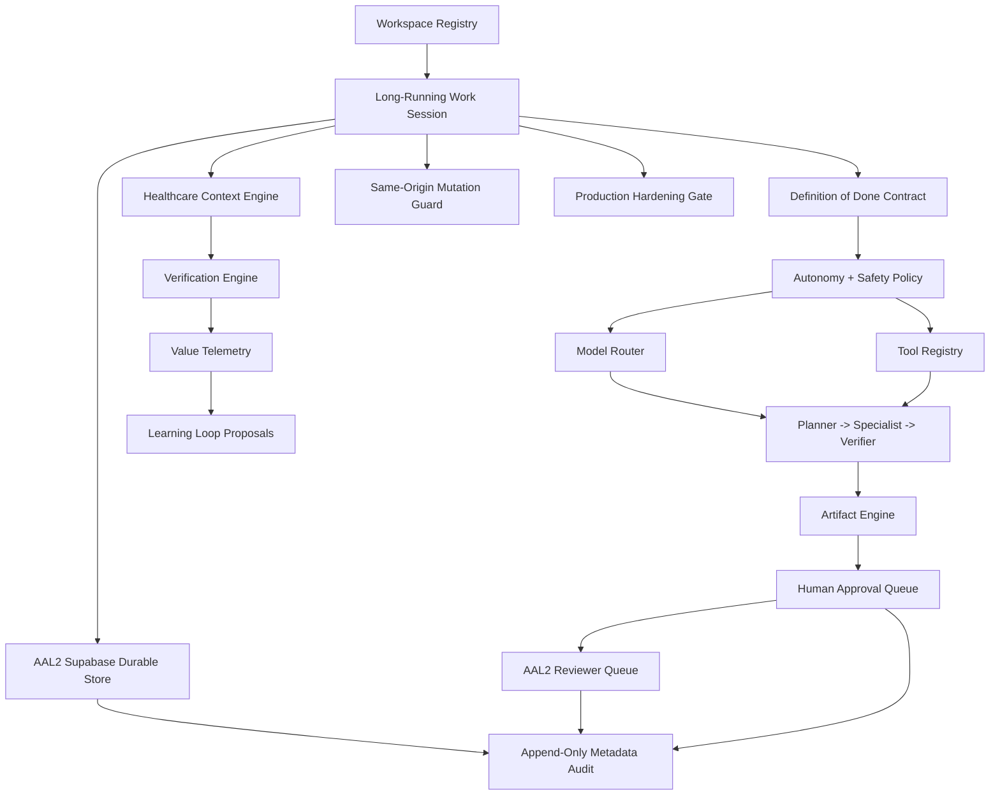

# SCRIMED Work & Intelligence Platform Implementation Plan

## Architecture Discovered

SCRIMED uses Next.js App Router with TypeScript strict mode. Feature logic is repo-native under `app/lib`, API routes are implemented with `app/api/**/route.ts`, public control-plane pages live under `app/**/page.tsx`, and validation is enforced through deterministic contract scripts in `scripts/*.mjs` wired into `package.json` and `scripts/scrimed-nonsecret-test-suite.mjs`.

Existing reusable foundations:
- `app/lib/scrimedSafetyGovernance.ts` defines current no-PHI, no-live-care, fail-closed safety policy.
- `app/lib/costApiGuardrails.ts` defines AI provider kill-switch and cost guardrails.
- `app/lib/scrimedIntelligencePlatform.ts` provides deterministic audit hashes.
- `app/lib/navigationAudit.ts` tracks public page inventory, smoke coverage, and API route count.
- `app/lib/siteNavigation.ts` is the primary navigation registry.
- Contract scripts verify route files, docs, smoke coverage, and retained safety language.

## Implementation Strategy

Build SCRIMED Work as a coherent vertical slice using `app/lib/scrimed-work/*` rather than a disconnected scaffold. The first release is synthetic, metadata-only, verification-first, and safe-by-default.

## Scope

Implement:
- typed work-session domains, statuses, risk levels, autonomy levels, artifacts, tools, providers, schedules, voice sessions, value telemetry, and audit records;
- a mandatory Definition-of-Done contract before any run is planned;
- autonomy scoring based on evidence, reversibility, observability, privacy, clinical consequence, financial consequence, blast radius, and provider reliability;
- provider-neutral model routing with configured synthetic/local/private fallback and no required secrets;
- least-privilege agent/tool registries;
- healthcare context ranking with lexical/semantic/trust/recency metadata;
- verification engine with schema, citation, scope, policy, PHI, budget, loop, rollback, and human-approval checks;
- disabled-by-default scheduled work definitions;
- voice-session simulation state machine with consent and emergency escalation boundaries;
- privacy-safe value telemetry including botsitting ratio and cost per verified artifact;
- JSON/Markdown artifact generation with review and verification metadata;
- App Router APIs and a `/scrimed-work` dashboard page;
- contract/smoke coverage and navigation audit wiring.
- protected durable-store adapter and ordered local Supabase migrations for AAL2/RBAC/RLS session, artifact, transition idempotency, lifecycle integrity, and audit persistence.
- production-hardening gate that separates evidence-ready controls from operator-required release steps.
- reviewer-only, tenant-scoped, audited artifact queue with strict metadata parsing and creator/reviewer separation.

## Safety Boundary

SCRIMED Work does not authorize live PHI, autonomous clinical care, diagnosis, treatment, prescribing, patient outreach, payer submission, EHR writeback, final imaging interpretation, production connector approval, regulatory/certification claims, customer go-live, or external model calls. Consequential actions remain disabled by default and require human approval plus future production authorization.

## Rollout Plan

1. Add typed local modules and deterministic synthetic fixtures.
2. Expose read-only summary, registries, schedules, and brief endpoints.
3. Expose mutation-shaped endpoints that validate requests, emit policy decisions, and fail closed without authorization.
4. Add `/scrimed-work` UI using server-rendered synthetic control-plane data.
5. Add `smoke:scrimed-work` contract and wire into nonsecret suite.
6. Add protected durable-store migration plus authenticated smoke command.
7. Add no-secret durable-store preflight for migration safeguards, environment readiness, AAL2 token shape, and strict operator gating.
8. Add no-secret production-hardening gate for protected-write, durable-store, Supabase runtime, server-token, AAL2, workspace, migration, and canary readiness.
9. Add an authoritative session lifecycle with database row locking, append-only history, independent reviewer separation, scoped mutations, and transition replay protection.
10. Add a bounded reviewer queue that operationalizes separation of duties without exposing raw artifact payloads.
11. Add a no-secret two-identity token policy, reviewer-token capture path, and strict lifecycle canary that proves reviewer-only queue access, self-approval denial, independent review, verification, and internal completion.
12. Add a browser-native admin preparation control and two-step reviewer queue so session approval and artifact disposition remain separate, explicit AAL2 actions without token export.
13. Derive a deterministic canary evidence ID from immutable review/completion evidence, the exact workspace, and the exact deployed Git SHA, then reject malformed or manually shaped release bindings.
14. Authenticate the canary with the server-held runtime authority and enforce a 72-hour freshness window with bounded clock-skew tolerance.
15. Bind successful canary evidence through nonsecret release-provenance identifiers; never retain bearer values as evidence.
16. Enforce exact same-origin browser mutations and explicit non-browser operator-smoke provenance at the shared write authorization boundary.
17. Enforce shared actor and tenant mutation quotas, require the distributed provider in production, and fail closed without provider availability.
18. Run typecheck, lint, nonsecret tests, build, generated-integrity, and diff checks.

## Production Hardening Required Later

- retain the verified ordered Supabase migration-set evidence, run `npm run smoke:scrimed-work:durable-store-preflight:strict`, then run `npm run smoke:scrimed-work:two-identity:strict` with separate operator and reviewer identities for each exact release SHA and workspace within the 72-hour promotion window;
- verify distributed actor/tenant mutation limits in each exact-release canary and retain only no-secret provider/decision evidence;
- add a retained abuse-event ledger and provider-health circuit-breaker telemetry before expanding protected write volume;
- add real queue/scheduler only after approval and feature flags;
- add approved provider credentials only through secret-managed deployment configuration;
- complete clinical, security, privacy, legal, procurement, and compliance reviews before live workflows.
