# SCRIMED p.34 Clinical Operating System

Status: local synthetic/no-PHI candidate. Named review and all contractual, clinical, privacy, security, migration, deployment, and customer approvals remain external.

Release boundary: `NO-GO` for live PHI, clinical operation, billing or payer action, EHR/device mutation, external provider activation, migration, deployment, customer activation, and external distribution.

## Objective

The p.34 Clinical Operating System extends the existing p.33 Context Fabric, Decision Evidence Ledger, exact-action policy, provider failover, quality ratchet, and p.34 workflow/action controls. It does not create another agent runtime or evidence platform.

The optimization target is cost per safe, clinically accepted workflow outcome. Safety, privacy, evidence, authorization, tenant isolation, and external validation remain noncompensable gates.

## Architecture

```mermaid
flowchart LR
  I["Authenticated synthetic intent"] --> W["Workflow + autonomy contract"]
  W --> P["PHI and secret boundary"]
  P --> S["Tenant sandbox policy review"]
  S --> R["Tenant-first context retrieval"]
  R --> M["Deterministic-first model fit"]
  M --> A["Approval interceptor"]
  A --> O["Bounded action or review draft"]
  O --> G["Tamper-evident governance ledger"]
  G --> E["Offline + online evaluation"]
  E --> V["External validation + oversight gate"]
  V --> C["Operator console and release matrix"]
  C --> H["Named human and external gates"]
```



## Implemented Controls

- `A0` displays information and `A1` prepares recommendations. A2/A3 requests may be structurally evaluated, but this candidate caps them at A1 and `REQUIRE_HUMAN` until a trusted store verifies and atomically consumes an exact approval. No clinical, billing, payer, EHR, destructive, permission, or external action can elevate itself.
- Every A2/A3 approval binds tenant, actor, approver, action, class, resource, payload, policy, idempotency key, authority scope, issue time, expiry, and evidence hash.
- Consequential decisions produce canonical SHA-256 records with a tenant ledger predecessor, actor and human authority, model/harness/prompt/policy/tool versions, citations, approvals, disposition, confidence, calibration, replay, supersession, and rollback state.
- Sensitive schema fields must appear in the PHI registry before startup. Unknown sensitive fields block startup.
- The synthetic in-memory token-vault adapter demonstrates tenant-contained reversible tokenization, purpose limitation, trusted-clock expiration, one-use validation grants, and revocation. It is not a production persistence adapter.
- Pre-egress inspection blocks raw PHI-like fields and credential material. Live PHI and external provider calls remain disabled even when documentary fields are populated.
- The sandbox policy evaluates tenant workspace boundaries, default-deny network, least-privilege filesystem access, no arbitrary mounts, no host credentials, opaque secret handles, resource ceilings, and cleanup requirements. A compliant policy remains `REQUIRE_HUMAN`; no runtime is authorized until canonical path containment and open-time verification are provided by an admitted sandbox adapter.
- Retrieval requires an authenticated tenant/purpose authorization context, then filters tenant, purpose, classification, and freshness before scoring. Caller-selected tenant scope is not authority. Ambiguous aliases or insufficient evidence abstain; contradictions require human review.
- Internal validation never satisfies the external clinical-validation gate. The external contract tracks sites, systems, devices, cohorts, subgroups, workflow settings, time periods, distribution shift, safety, calibration, abstention, overrides, and named review.
- Oversight metrics track review percentage, absolute errors, corrections, overrides, silent acceptance, latency, and cohort coverage. Apparent accuracy cannot lower review automatically.
- Patient Take-Home output is a source-grounded educational preview. Preferences, accessibility, proxy authority, sensitive-result policy, and clinician review are enforced; delivery remains disabled.
- Medical coding defaults to assisted drafting. Autonomous coding and billing submission remain disabled.
- Operations recovery classifies retries, verifies checkpoints, preserves idempotency, supports suspension, and sends terminal failures to dead-letter review.
- Public-claim metadata is structurally validated, but publication remains unauthorized until trusted evidence lookup and named publication approval succeed. Owner, wording, primary evidence, scope, limitations, audience, channel, expiry, and revalidation remain mandatory.

## Feature Flags

Safe local controls default on:

- `SCRIMED_P34_CLINICAL_OPERATING_SYSTEM_ENABLED`
- `SCRIMED_P34_AUTONOMY_CONTRACT_ENABLED`
- `SCRIMED_P34_PHI_BOUNDARY_ENABLED`
- `SCRIMED_P34_SANDBOX_POLICY_ENABLED`
- `SCRIMED_P34_EXTERNAL_VALIDATION_ENABLED`
- `SCRIMED_P34_PATIENT_TAKE_HOME_PREVIEW_ENABLED`
- `SCRIMED_P34_MEDICAL_CODING_DRAFT_ENABLED`

High-risk flags retain their existing false defaults, including live PHI, consequential execution, external providers, trust expansion, challenger evaluation, public-sector claims, DICOM export, and production promotion. A flag never replaces evidence or approval.

## Read-Only Routes

- `/scrimed-p34`
- `/api/scrimed-control-plane/p34/clinical-os`
- `/api/scrimed-control-plane/p34/autonomy`
- `/api/scrimed-control-plane/p34/phi-boundary`
- `/api/scrimed-control-plane/p34/sandbox`
- `/api/scrimed-control-plane/p34/retrieval`
- `/api/scrimed-control-plane/p34/external-validation`
- `/api/scrimed-control-plane/p34/oversight`
- `/api/scrimed-control-plane/p34/patient-take-home`
- `/api/scrimed-control-plane/p34/medical-coding`
- `/api/scrimed-control-plane/p34/recovery`
- `/api/scrimed-control-plane/p34/claims`

## Local Operation

```bash
npm run test:scrimed-p34-clinical-os
npm run contract:scrimed-p34-clinical-os
npm run test:scrimed-p34
npm run test:scrimed-p34-workflow-continuity
npm run check:scrimed-p34-artifacts
```

No migration, dependency, provider credential, external sandbox, PHI source, or live connector is added by this wave.
