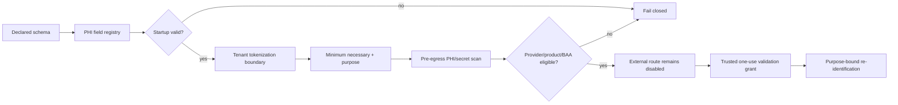

# SCRIMED p.34 PHI And Secret Data Flow

Status: no live PHI. The current implementation uses synthetic/no-PHI fixtures only.

## Classification

Each sensitive schema field records schema, path, sensitivity class, data type, tokenization requirement, permitted purposes, retention class, and owner. Unknown sensitive fields block startup. The registry hash binds the canonical field set.

## Tokenization

The local adapter issues tenant-, field-, purpose-, issue-, and expiry-bound opaque tokens. Tokens contain no plaintext. Resolution requires the same tenant and purpose, an unexpired entry evaluated with the vault's trusted clock, and a one-use validation grant issued by an admitted validator. Caller-supplied timestamps or validation booleans are not authority. Tenant revocation removes future resolution. The adapter is in-memory and explicitly not production-ready.

## Egress

Pre-egress evaluation checks:

- registered fields;
- minimum necessary and consent/authority;
- raw PHI-like and secret-like keys or values;
- token receipt tenant, field, shape, hash, and expiry;
- exact token-receipt integrity and one-use trusted validation;
- provider PHI permission;
- signed BAA evidence and covered product path.

The local candidate always denies live PHI and returns `providerCallAuthorized: false`.

## Secrets

Models receive opaque secret handles only. A handle is bound to tenant, runtime, purpose, secret class, and expiry and declares that plaintext is not exposed to the model. Host credential inheritance is prohibited.

## Break Glass

Break-glass access requires a distinct approver, reason code, incident reference, bounded scope, audit-event hash, maximum one-hour lifetime, and mandatory review. It cannot grant clinical authority and is not activated in this candidate.
