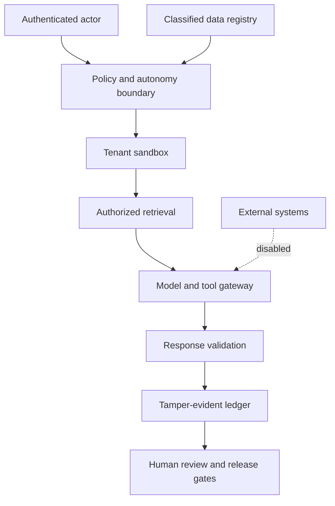

# SCRIMED p.34 Clinical Operating System Threat Model

Status: local synthetic threat model; independent security, privacy, clinical-safety, and platform review remain required.

## Assets

- Tenant-scoped context and evidence references
- Authenticated actor and accountable-human identity digests
- Exact approvals and idempotency keys
- Provider, model, policy, prompt, tool, dataset, and build versions
- Governance, evaluation, rollback, and release evidence
- Secret handles and future token-vault records

Raw PHI, plaintext secrets, hidden reasoning, unrestricted prompts, and production credentials are prohibited from local fixtures, telemetry, and evidence artifacts.

## Trust Boundaries

## Threats And Controls

| Threat | Preventive control | Failure state |
| --- | --- | --- |
| Missing, stale, replayed, or payload-mismatched approval | Exact scoped approval binding; local candidate requires trusted-store verification and atomic consumption before any future execution | BLOCK or REQUIRE_HUMAN |
| Task elevates its autonomy | Requested tier capped by policy; external action classes cannot enter A2/A3 | BLOCK |
| Sensitive schema field is unclassified | Startup registry validation with deny-unknown | BLOCK startup |
| Raw PHI or secret crosses egress | Structured key/value scan, token receipts, provider/BAA/product checks | BLOCK |
| Cross-tenant re-identification | Tenant-bound opaque token key, purpose/expiry validation, trusted vault clock, and one-use validator grant | BLOCK |
| Break-glass becomes standing access | Independent approver, incident reference, audit event, one-hour ceiling, mandatory review | BLOCK or REQUIRE_HUMAN |
| Agent escapes the workspace | Absolute-path policy roots, no arbitrary mounts, and no host credentials; runtime authorization remains false pending canonical containment and open-time checks | BLOCK or REQUIRE_HUMAN |
| DNS, proxy, loopback, or direct network escape | Default-deny egress and exact domain allowlist | BLOCK |
| Retrieved document changes authority | Retrieval is data only; tool and autonomy scopes are evaluated separately | BLOCK |
| Prompt injection or indirect instruction in retrieved content | Treat retrieved content as untrusted evidence only; never expand tools, network, autonomy, or approval scope | BLOCK |
| Wrong-tenant evidence influences ranking | Authenticated tenant and purpose authorization before scoring; caller-selected tenant is not authority | BLOCK |
| Similar names produce a false match | Canonical entity and alias ambiguity detection | ABSTAIN |
| Stale or unsupported evidence becomes fact | Effective/expiry checks and source-span requirement | BLOCK |
| Aggregate score hides a failing subgroup | Worst-cell and external-validation gates | BLOCK |
| Apparent success reduces review | Approved review-rate floor and explicit reduction approval | BLOCK |
| Patient education bypasses review or proxy scope | Preferences, proxy hashes, sensitive-result rule, clinician review | REQUIRE_HUMAN or BLOCK |
| Coding draft becomes a bill | Assisted mode default and billing authority fixed false | BLOCK |
| Retry duplicates a write | Tenant idempotency, checkpoint verification, bounded attempts, dead-letter state | BLOCK |
| Governance history is rewritten | Canonical record hash plus per-tenant predecessor chain | BLOCK verification |
| Public claim outlives or fabricates evidence | Structural metadata validation plus trusted evidence lookup, named approval, expiry, and revalidation gate; publication remains false locally | BLOCK or REQUIRE_HUMAN |

## Residual Risks

- The token vault is an in-memory synthetic adapter and is not suitable for production persistence or PHI.
- The local candidate has no trusted atomic approval store or canonical/open-time filesystem containment adapter, so exact A2/A3 requests and policy-compliant sandbox requests remain review-only.
- Hash chaining is application-level tamper evidence and is not an externally anchored immutable store.
- Sensitive-field scanning is a defense-in-depth heuristic, not a substitute for approved data contracts and DLP.
- No external sandbox, model provider, identity provider, clinical system, PHI route, or customer environment was tested.
- External clinical validation, BAA/product coverage, legal review, security review, AAL2 evidence, migration authorization, deployment authorization, and customer go-live remain unresolved.
