# SCRIMED p.33 Integrated Upgrades

Status: local synthetic implementation; qualified human review required.

## Mission

SCRIMED p.33 applies the operating principle **“Walk with doctors, not replace them.”** Clinical functions remain explainable decision support under qualified human authority. No module in this implementation can autonomously diagnose, prescribe, treat, triage, determine coverage, submit a claim, write to an EHR, process live PHI, deploy, or activate a customer.

## Architecture

```mermaid
flowchart LR
  S["Synthetic or approved de-identified sources"] --> C["Clinical Context Fabric v2"]
  C --> V["Purpose-bound context view"]
  V --> X["Clinical Signal Compression"]
  X --> G["Clinical Extraction Release Gate"]
  G --> H["Qualified human review"]
  V --> A["Portable Agent Task Envelope"]
  A --> R["Model-harness-task router"]
  R --> W["Sandboxed local worker or safe refusal"]
  G --> L["Decision Evidence Ledger"]
  W --> L
  H --> L
  L --> E["Trace-to-Eval Foundry"]
  E --> T["Synthetic ClinicalTrajectory Lab"]
  T --> O["Oversight Drift Sentinel"]
  O --> Q["Continuous Assurance quality ratchet"]
  Q --> Z["G21-G25 and separate readiness decisions"]
```

## Context Fabric

`app/lib/scrimed-p33/contextFabric.ts` builds one versioned `ContextArtifact` from structured or unstructured sources and then serves authorized, minimum-necessary views. Each fact retains exact source spans, Unicode scalar and UTF-16 offsets, source hashes, note type, confidence, uncertainty, terminology mapping, timeline position, and contradiction state.

The included synthetic fixture demonstrates discharge-summary and radiology structure. It contains no raw PHI. Restricted terminology snapshots remain caller-supplied and license-gated; network retrieval is not enabled.

Context invalidation is deterministic over source hashes, policy version, and artifact version. Revoked, expired, cross-tenant, out-of-purpose, or overbroad section grants fail closed and emit a digest-only audit decision.

## Signal Compression

`compressClinicalSignals` ranks review signals but preserves citations, temporal events, uncertainty, medication-dose warnings, contradictions, missing information, and an explicit list of omitted sections. The result is labeled decision support, requires human review, and never replaces the source record.

`evaluateClinicalExtractionReleaseGate` blocks or requires review when provenance, evidence, policy identity, terminology authorization, safety checks, contradiction handling, or qualified review is incomplete. FHIR, OMOP, OpenEHR, and typed MCP adapters create synthetic previews only after a passing gate; they cannot write to a clinical system.

## Decision Evidence

`app/lib/scrimed-p33/decisionEvidenceLedger.ts` implements append-only SHA-256 chaining. Each record binds tenant, trace, actor digest, accountable authority, scope, intended use, policy, Regulatory Label version, model/provider/harness, prompt, tools, build, consent, evidence, input/output digests, constraints, review state, outcome, affected objects, reversibility, and replay recipe.

Verification detects duplicate IDs, predecessor mismatch, content tampering, and prohibited content flags. Retrieval is tenant-scoped. Replay tooling exposes exact versions and evidence references without raw input or hidden chain-of-thought.

## Regulatory Label And Oversight

The `RegulatoryLabelTwin` binds intended and excluded uses, jurisdiction, authorized roles, public-claim IDs, evidence, data classes, risk, validations, release gates, effective dates, and supersession history. Requests outside the label are blocked or routed to review.

The `OversightDriftSentinel` preserves fixed sentinel cohorts and risk-based review floors. Accuracy cannot lower human oversight by itself. Review-rate drift, missing cohorts, independent error-budget violations, automation bias, silent workflow expansion, false reassurance, and low-frequency harm signals cause review or blocking decisions.

## Agent Portability

The provider-neutral `AgentTaskEnvelope` and `AgentResultEnvelope` describe capability, identity, tenant, tools, filesystem, network, locality, approval, evidence, citation, time, token, cost, CPU, memory, and turn limits. Routing selects only candidates that pass capability, risk, locality, qualification, availability, evidence, and budget requirements. It returns an explicit safe refusal when no candidate qualifies.

The local worker requires a sandbox, task-bound identity, active capability lease, deny-by-default network, explicit filesystem roots, tool allowlists, resource limits, and an armed kill switch. Confidential-compute fields report capability state but do not imply hardware support. Provider calls remain disabled.

## Trace-To-Eval

The synthetic ClinicalTrajectory Lab evaluates a proposed workflow against a held-out trajectory after a hard cutoff. It scores semantic match, required-step specificity, groundedness, critical omissions, hallucinated additions, contraindicated suggestions, tool validity, completion, turns, latency, token volume, cost, cache behavior, and human disposition.

Production trace mining stays disabled until de-identification, consent, retention, BAA, privacy, and named review evidence passes. Evaluation cannot itself promote a model or clinical workflow.

## Opportunity Modules

P0:

- Rural Transformation Capture Lane
- Rural Care Signal Navigator, default off
- Clinical Signal Compression

P1:

- Prior Authorization / ePA Readiness, default off
- QPA Regulatory Replay Engine, default off
- PACE Rate Viability Lens, default off
- Vendor Continuity Radar
- Hybrid Workload Placement

P2:

- Clinician Re-engagement Data Quality, default off
- Evidence-Backed AI Discoverability

Every module declares a feature flag, typed workflow, evidence requirements, operational KPIs, investor relevance, human-review requirement, and boundary. External actions are disabled for all modules.

## Pilot Profiles

- `NON_PHI_CONTROLLED_PILOT`: can pass local technical eligibility using synthetic or properly approved de-identified data after its technical gates pass.
- `PHI_CAPABLE_PILOT`: blocked pending an applicable BAA and eligible product path, fresh AAL2 evidence, tenant isolation, RLS, encryption, durable audit, retention/deletion, approved subprocessors, incident handling, minimum-necessary validation, and named privacy/security and clinical-safety review.
- `LINUX_LOCAL_AGENT_PILOT`: blocked pending official platform support and validated sandbox, filesystem, network, update, audit, privacy/security, and clinical-safety controls.

Restricted profiles have no bypass flag. Unsafe environment variables are ignored by the feature-flag resolver and the profile gate remains authoritative.

## Continuous Assurance

`app/lib/scrimed-p33/continuousAssurance.ts` adds one policy and evidence extension to the existing p.33 control plane. It separates tool discovery from authorization, binds approvals to the exact actor/candidate/action/arguments/target/policy/expiry, enforces tenant and filesystem/network scope, and blocks PHI, production targets, stale evidence, self-approval, and consequential execution in this local candidate.

The same module validates materially independent provider failover, applies a hard-floor and worst-cell quality ratchet, evaluates a typed pilot value contract, tracks G21-G25 with evidence age and expiry, and reports local, controlled non-PHI, Linux non-PHI, PHI-capable, and production/customer readiness independently. See `docs/assurance/CONTINUOUS_ASSURANCE_AND_PILOT_READINESS.md`.

## Feature Flags

Safe local controls default on:

- `SCRIMED_P33_INTEGRATED_UPGRADES_ENABLED`
- `SCRIMED_P33_CONTEXT_FABRIC_ENABLED`
- `SCRIMED_P33_CLINICAL_SIGNAL_COMPRESSION_ENABLED`
- `SCRIMED_P33_DECISION_LEDGER_ENABLED`
- `SCRIMED_P33_OVERSIGHT_SENTINEL_ENABLED`
- `SCRIMED_P33_TRACE_TO_EVAL_ENABLED`
- `SCRIMED_P33_RURAL_TRANSFORMATION_ENABLED`
- `SCRIMED_P33_VENDOR_CONTINUITY_ENABLED`
- `SCRIMED_P33_HYBRID_PLACEMENT_ENABLED`

High-risk and external capabilities remain off:

- `SCRIMED_P33_RURAL_CARE_SIGNAL_ENABLED`
- `SCRIMED_P33_EPA_READINESS_ENABLED`
- `SCRIMED_P33_QPA_REPLAY_ENABLED`
- `SCRIMED_P33_PACE_RATE_LENS_ENABLED`
- `SCRIMED_P33_CLINICIAN_REENGAGEMENT_ENABLED`
- `SCRIMED_P33_EXTERNAL_PROVIDER_CALLS_ENABLED`
- `SCRIMED_P33_EXTERNAL_OUTREACH_ENABLED`
- `SCRIMED_P33_LIVE_PHI_ENABLED`
- `SCRIMED_P33_LIVE_CLINICAL_OPERATION_ENABLED`
- `SCRIMED_P33_PHI_CAPABLE_PILOT_ENABLED`
- `SCRIMED_P33_LINUX_LOCAL_AGENT_PILOT_ENABLED`
- `SCRIMED_P33_PRODUCTION_TRACE_MINING_ENABLED`

## Routes

- UI: `/scrimed-p33`
- Summary: `/api/scrimed-control-plane/p33`
- Brief: `/api/scrimed-control-plane/p33/brief`
- Context: `/api/scrimed-control-plane/p33/context`
- Evidence: `/api/scrimed-control-plane/p33/evidence`
- Opportunities: `/api/scrimed-control-plane/p33/opportunities`
- Pilot profiles: `/api/scrimed-control-plane/p33/pilots`
- Continuous assurance: `/api/scrimed-control-plane/p33/assurance`

## Operations And Rollback

1. Run targeted p.33 policy and contract tests.
2. Run typecheck, lint, nonsecret tests, build, generated integrity, secret scan, SBOM, public smoke, browser verification, and `git diff --check`.
3. Obtain independent technical, clinical-safety, claims/legal, security/privacy, platform, and founder/counsel/finance review against exact fingerprints.
4. Keep production, PHI, Linux local-agent, deployment, migration, provider, outreach, payer, EHR, and customer flags disabled.
5. Roll back by reverting the attributable local commit. Preserve decision-ledger and review evidence; do not delete audit history.

No production migration is introduced by p.33. Existing unapplied migrations retain their separate disposable-database and owner-approval gates.

## Local Verification Evidence

The final pre-commit candidate pass verifies the deterministic p.33 policy and contract suites, full nonsecret suite, typecheck, lint, production build, generated integrity, secret scan, SBOM, public-release contracts, and `git diff --check`. The built p.33 page was also inspected at 1280px and 390px without horizontal overflow or browser console warnings.

The p.33 control plane exposes seven logical endpoints, including continuous assurance. Final-candidate validation must recheck each endpoint and the Product Console from the final production build; the compact Product Console must not embed the full p.33 domain payload.

The rendered 12-slide internal investor artifact has SHA-256 `b042b32834de48bceb337d8b33fe14242ca7bff8869722ca41e096b75999b4b9`. Automated structure, prohibited-claim, boundary, and overflow checks pass. External distribution remains explicitly unauthorized pending founder, counsel, and finance review of that exact artifact.
