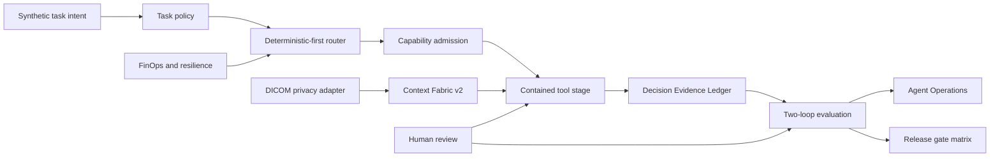

# SCRIMED p.34 Adaptive Governance

Status: local synthetic/no-PHI candidate. Independent review and every external authorization remain pending.

## Architecture



The p.34 layer extends p.33 rather than replacing it:

- p.33 `ContextArtifact` remains the canonical context object.
- p.33 exact-action authorization remains the service-level policy authority.
- p.33 `DecisionEvidenceRecord` remains the append-only ledger primitive.
- p.33 provider-dependency checks remain the failover independence test.
- p.33 quality ratchet remains the noncompensable promotion gate.
- p.34 adds capability expiry, deterministic-first technique selection, document hierarchy, DICOM privacy manifests, richer action details, two-loop evidence, task economics, placement policy, and operator visibility.

## Governance Hierarchy

### Framework

Principles: minimum necessary data, deterministic sufficiency, least privilege, human authority, evidence before assertion, vendor replaceability, safe refusal, contemporaneous audit, and cost per safe accepted outcome.

Ownership:

| Domain | Accountable owner | Required independent review |
| --- | --- | --- |
| Clinical safety | Clinical safety owner | Qualified clinical reviewer |
| Privacy and data use | Privacy owner | Privacy/legal reviewer |
| Security and identity | Security owner | Independent security reviewer |
| Model/provider admission | Model governance owner | Platform + safety reviewers |
| DICOM de-identification | Imaging privacy owner | Imaging privacy + clinical reviewers |
| Evaluation and promotion | Evaluation owner | Independent technical/clinical reviewers |
| Pilot value | Business workflow owner | Customer-designated owner before external use |
| Release | Release owner | Exact-candidate named reviewers |

### Policies

- Unknown, missing, disabled, expired, revoked, or unverified capability is denied.
- Deterministic validation, transformation, graph, optimization, and retrieval techniques precede generation.
- Clinical, identity, authorization, consent, billing, and irreversible-write decisions cannot fall through to unrestricted generation.
- State-changing actions require exact payload-bound human approval and remain disabled in this candidate.
- Retrieved content is data, not executable instruction.
- DICOM metadata removal does not establish anonymization; uncertain pixels are quarantined.
- No challenger self-promotes and no safety, privacy, authorization, provenance, or clinical floor can be traded away.
- Public claims require primary evidence, owner, approved wording, retrieval date, expiry, and applicable legal review.

### Standards

- Every admitted route has a content digest, harness, modalities, risk/data limits, regions, environments, budgets, tools, approvals, effective date, and revalidation date.
- Every context fact retains source hash and span; p.34 chunks add heading path, table headers, page/bounding box, token estimate, freshness, confidence, and contradiction group.
- Every DICOM decision emits hash-only before/after manifests, policy and operator identity, private-tag findings, pixel disposition, and retained export block.
- Every consequential decision binds tenant, actor, delegated authority, intended use, task/risk class, evidence, policy, route, tools, approvals, result, exception, escalation, time, and predecessor hash.
- Cache identities include tenant and namespace. Retries, fallbacks, turns, time, tokens, and cost are bounded.

### Guidelines And Runbooks

Operational procedures are in `docs/runbooks/P34_ADAPTIVE_GOVERNANCE_RUNBOOK.md`. Threat and residual-risk changes are in `docs/security/P34_THREAT_BOUNDARY_UPDATE.md`.

## Two-Loop Evaluation

The inner loop runs fixed synthetic/de-identified cases for safety, grounding, citations, extraction, tool selection, completion, latency, and cost. Repeated trials record variation.

The outer loop accepts only privacy-safe shadow metrics for completion, abandonment, correction, escalation, repeated prompting, unsupported assertions, tool failure, approval denial, latency, and cost. Raw PHI is prohibited. Production-like failures may become regression candidates only after de-identification and review.

Promotion requires all hard floors, worst-cell evidence, rollback readiness, and independent review. Automatic promotion is always false.

## Feature Flags

Safe local evaluation defaults on:

- `SCRIMED_P34_ADAPTIVE_GOVERNANCE_ENABLED`
- `SCRIMED_P34_DETERMINISTIC_ROUTER_ENABLED`
- `SCRIMED_P34_CONTEXT_PROVENANCE_ENABLED`
- `SCRIMED_P34_SYNTHETIC_DICOM_PRIVACY_ENABLED`
- `SCRIMED_P34_DECISION_LEDGER_ENABLED`
- `SCRIMED_P34_TWO_LOOP_EVALUATION_ENABLED`
- `SCRIMED_P34_FINOPS_RESILIENCE_ENABLED`
- `SCRIMED_P34_HYBRID_PLACEMENT_ENABLED`

High-risk capability defaults off:

- `SCRIMED_P34_EXTERNAL_PROVIDER_CALLS_ENABLED`
- `SCRIMED_P34_DICOM_EXPORT_ENABLED`
- `SCRIMED_P34_LIVE_PHI_ENABLED`
- `SCRIMED_P34_CONSEQUENTIAL_EXECUTION_ENABLED`
- `SCRIMED_P34_PRODUCTION_PROMOTION_ENABLED`

Changing a flag does not satisfy policy, evidence, approval, identity, legal, clinical, privacy, security, migration, deployment, or customer gates.

## Evidence Retention

Retain hash-addressed policy decisions, approvals, route decisions, evaluation summaries, incident records, and rollback receipts according to the approved tenant retention schedule. Do not retain raw prompts, raw PHI, secrets, hidden reasoning, source DICOM values, or pixel data in general telemetry. Legal hold and deletion requests require authorized operator handling and append-only receipts.

## Pilot Checklists

### Non-PHI Pilot

- Synthetic or formally approved de-identified data only.
- Named business and workflow owner.
- Exact intended use, task policy, acceptance criteria, and stop conditions.
- Tenant isolation and deny-by-default tool/network checks.
- Fixed evaluation suite, worst-cell result, review plan, cost baseline, rollback rehearsal.
- Exact-candidate technical, security/privacy, and claims review.
- No external call, customer data, outreach, clinical action, payer submission, or writeback.

### PHI-Capable Pilot

Blocked in this candidate. Before reconsideration: legal data-use authority, BAA/DPA/service scope, region/residency/retention evidence, identity and access controls, tenant isolation, production audit persistence, approved provider/environment passport, security/privacy review, clinical review, incident response, recovery test, customer authorization, and explicit release decision.

### Production Release

Blocked in this candidate. Requires a clean exact commit, generated evidence integrity, named review, fresh AAL2 authorization, approved migrations where applicable, intended-use/legal/clinical/security/privacy signoffs, deployment authorization, exact-environment verification, post-deployment smoke evidence, rollback owner, and customer-specific go-live authority.

## Routes

- UI: `/scrimed-p34`
- Summary: `/api/scrimed-control-plane/p34`
- Brief: `/api/scrimed-control-plane/p34/brief`
- Registry: `/api/scrimed-control-plane/p34/registry`
- Operations: `/api/scrimed-control-plane/p34/operations`
- Context: `/api/scrimed-control-plane/p34/context`
- DICOM privacy: `/api/scrimed-control-plane/p34/dicom-privacy`
- Assurance: `/api/scrimed-control-plane/p34/assurance`

## Validation

```bash
npm run test:scrimed-p34
npm run contract:scrimed-p34
npm run check:scrimed-p34-artifacts
npm run typecheck
npm run lint
npm run test:nonsecret
npm run build
npm run security:secret-scan
npm run security:sbom
node scripts/check-generated-integrity.mjs
git diff --check
```

No database migration or external dependency is added by p.34.
