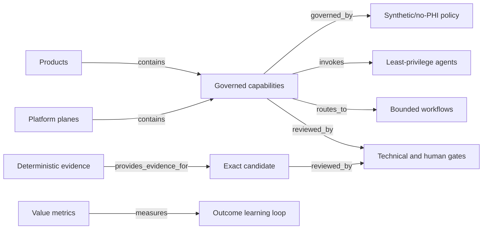

# SCRIMED Platform Graph

**Source:** `app/lib/scrimed-control-plane/platformGraph.ts`
**Artifact:** `artifacts/platform/scrimed-platform-graph.json`

The graph converts SCRIMED's architecture into deterministic, testable metadata. It includes
platform planes, products, capabilities, agents, workflows, model policies, connectors, APIs,
persistence, environments, releases, evidence, approvals, metrics, proof routes, policies, and
moats. Every node and edge carries a stable audit hash.

## Enforced Integrity

- Duplicate node and edge identifiers fail validation.
- Dangling edges and orphan nodes fail validation.
- Every capability must have a policy edge.
- Every high-risk capability must have a review edge.
- All nodes remain synthetic-only and grant no external authority.
- Protected-pilot, migration, AAL2, named review, distribution, deployment, and customer
  activation remain separate gates.

Graph presence is architectural evidence only. It does not establish production maturity,
regulatory status, certification, customer adoption, partnership, revenue, ROI, or clinical
authority.
