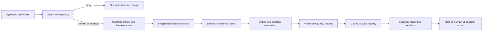

# SCRIMED Continuous Assurance And Pilot Readiness

Status: implemented for local synthetic evaluation; exact-candidate human review and operator evidence remain required.

## Decision

SCRIMED extends the existing p.33 control plane rather than adding a second governance system. `app/lib/scrimed-p33/continuousAssurance.ts` composes the existing Context Fabric, Decision Evidence Ledger, portable-agent router, ClinicalTrajectory evaluation, pilot profiles, and release evidence tooling into a deterministic continuous-assurance layer.

The optimization target is cost per safe, clinically accepted outcome. Safety, authorization, privacy, clinical boundaries, provenance, and worst-material-cell performance are noncompensable floors.

## Implementation Ledger

| Directive area | Existing coverage | Change in this candidate | Status |
|---|---|---|---|
| Tamper-evident decisions | p.33 Decision Evidence Ledger | Added a richer continuous-assurance record, chain verification, redacted export, runtime metrics, execution scope, approvals, rollback, and no-hidden-reasoning fields | Implemented locally |
| G21-G25 | p.32 release gates and p.33 gate matrix | Added dependency failover, value contract, shadow adoption, freshness/binding, and portability gates with owner, evidence, age, expiry, remediation, and digest | Implemented; G22-G24 retain human/operator gates |
| Agent policy executor | SCRIMED Work authorization and p.33 local-worker admission | Added exact action/argument/target/candidate approval binding, discovery/authority separation, tenant checks, filesystem/network allowlists, expiry, dry-run, and production denial | Implemented locally |
| Model/harness routing | p.33 portable router and control-plane registry | Added materially independent failover validation and explicit no-downgrade evidence; provider calls remain off | Implemented locally |
| Context and documents | p.33 Context Fabric | Existing source spans, section structure, Unicode offsets, temporal/coreference links, terminology snapshots, FHIR/OMOP/OpenEHR previews, and abstention gates are adequate | Existing and tested |
| Evaluation | ClinicalTrajectory and Oversight Drift Sentinel | Added hard-floor quality ratchet, worst-cell requirement, cost/latency approval, and no automatic promotion | Implemented locally |
| PHI/clinical safety | Pilot profiles and operating boundaries | Added five distinct readiness decisions; every profile continues to deny PHI, clinical action, deployment, and activation | Implemented locally |
| Value and adoption | Healthcare Value Realization and Pilot Value Evidence | Added a typed per-pilot value contract with baseline, comparator, owners, stop rules, adoption, affected systems, and exit plan | Implemented; owner approval required |
| Supply chain | Node 24 CI, audit, CodeQL, secret scan, SBOM, fingerprints | New assurance evidence composes these controls; no dependency or migration was added | Existing and candidate validation required |

## Architecture

## Agent Authorization

Tool discovery is informational. A discovered tool has no authority until the system-of-record authorization independently permits the exact tenant, candidate, tool, network destination, filesystem root, and expiry. Writes and consequential actions require an approval bound to the actor, candidate, action, arguments, target, policy, and expiration.

The local candidate permits policy evaluation and synthetic dry-run or shadow preparation only. It does not execute provider calls or external mutations. Production targets, PHI-classified input, stale approvals, cross-tenant authorization, unexpected network destinations, filesystem traversal, self-approval, and non-dry-run consequential execution block.

## Strategic Gates

- `G21`: qualified primary route, materially independent fallback, and recovery test.
- `G22`: complete value contract, baseline/comparator, and named owner approval.
- `G23`: shadow rehearsal, adoption/training plan, stop/rollback rules, and named pilot owner.
- `G24`: exact source manifest, fresh validation packet, and exact-candidate reviewer attestation.
- `G25`: provider-neutral adapter, configuration export, independent route, and exit runbook.

Evidence bound to another candidate or past expiry is `BLOCKED`. Complete automation with irreducible named approval is `OPERATOR_REQUIRED`; a template is never approval evidence.

## Quality Ratchet

The challenger must pass every safety, authorization, privacy, clinical, provenance, task-level, and worst-material-cell floor. Quality, grounding, severe-error rate, and unauthorized-action rate cannot regress. Cost or latency regression requires explicit approval. Even a passing challenger is only eligible for independent review; automatic promotion remains disabled.

Oversight sampling continues to follow consequence, volume, novelty, drift, and sentinel cohorts. Higher percentage accuracy alone cannot reduce review.

## Value Contract Template

Every pilot contract must identify the workflow, baseline, comparator, intended user, business owner, clinical owner when applicable, measurement window, success thresholds, safety stop thresholds, rollback criteria, cost/capacity metrics, adoption/training plan, affected systems, and exit/export plan. Missing fields block the gate; complete contracts still require named owner approval. No ROI or financial claim is authorized by this record.

## Readiness Matrix

| Profile | Current code posture | Authority retained |
|---|---|---|
| Local technical candidate | Eligible after the exact final validation suite passes | No PHI, clinical action, deployment, or distribution |
| Controlled non-PHI pilot | Exact candidate, named review, AAL2, migration, intended-use, security/privacy, and platform evidence required | Operator controlled |
| Linux non-PHI pilot | Official support and complete sandbox/filesystem/network/update/audit evidence required | Blocked |
| PHI-capable pilot | BAA, eligible product coverage, approved data flow, identity, retention, incident, privacy/security, clinical, and candidate evidence required | Blocked |
| Production/customer go-live | Deployment authorization, post-deployment evidence, customer acceptance, and every prerequisite required | Blocked |

## Recovery

1. Deny new actions and revoke capability leases.
2. Preserve decision digests, trace IDs, policy versions, exact route, and affected-object identifiers.
3. Disable the affected feature flag or route.
4. Revert the attributable candidate through the normal reviewed Git workflow.
5. Retest the fixed sentinel set, failure fixture, independent fallback, and rollback path.
6. Regenerate exact-candidate evidence and obtain required named review.

## External Actions

Fresh exact-candidate review, AAL2 evidence, database-owner migration authorization, intended-use approval, claims/legal review, clinical-safety review, security/privacy review, platform/deployment authorization, Supabase leaked-password protection, post-deployment evidence, and customer go-live remain outside software authority.

No live PHI, provider call, migration, deployment, clinical action, payer action, EHR writeback, customer activation, or external distribution is authorized by this implementation.
