# SCRIMED Clinical Assurance Control Plane

## Purpose

The Clinical Assurance Control Plane is SCRIMED's repository-native authorization layer for model and agent routes. It binds a request to a data classification, Clinical Assurance Level (CAL), Sovereign Clinical Enclave, exact signed Model Passport, capacity admission, concentration budget, validated domain cell, independent fallback, policy decision, and CaseEvidence event before execution.

CAL is an internal SCRIMED control classification. It is not an external certification, government impact level, regulatory clearance, or customer deployment approval.

## Runtime Flow

```mermaid
flowchart LR
  A["Classify workflow and data"] --> B["Resolve CAL and enclave"]
  B --> C["Verify exact model passport"]
  C --> D["Check signature, scans, SBOM and ML-BOM"]
  D --> E["Evaluate worst material domain cell"]
  E --> F["Admit capacity and concentration"]
  F --> G["Verify independent fallback"]
  G --> H["Bind policy decision and CaseEvidence"]
  H --> I["Route, queue, hand off, or block"]
```



The first vertical slice is the synthetic PayerIQ Documentation-Before-Authorization workbench. Its deterministic review packet now includes exact assurance, enclave, model/fallback digest, capacity, concentration, routing, subgroup, queue, retry, and disposition metadata.

## Assurance Levels

| Level | Intended boundary | Required posture |
| --- | --- | --- |
| CAL-0 | Public, synthetic, or irreversibly de-identified | No PHI authority, isolated synthetic indexes and evidence |
| CAL-1 | Standard PHI, after separate approval | Tenant isolation, approved contracts/region, audit, encryption, validated fallback |
| CAL-2 | Restricted clinical data | Private networking, default-deny egress, named operators, explicit allowlists, separate scopes |
| CAL-3 | Customer-sovereign isolated operation | Isolated control/data planes, reserved capacity, signed offline promotion, tested export and recovery |

Only CAL-0 is represented by an active synthetic fixture. CAL-1 through CAL-3 are policy contracts and negative-path tests; they are not activated for live data.

## Core Registries

- `SovereignClinicalEnclave`: tenant, jurisdiction, region, data, model, tool, workflow, key, egress, storage-scope, operator, capacity, SLO, RTO, RPO, owner, and approval metadata.
- `ModelPassport`: immutable digest, provider/corporate lineage, infrastructure, license, data policy, authorization scope, evaluation evidence, signature, SBOM/ML-BOM, scans, expiry, kill switches, and portability.
- `ToolArtifactPassport`: exact tool/version digest, tenant/workflow/CAL scope, signature, SBOM, scans, expiry, and kill switch.
- `CapacityPassport`: contracted, reserved, observed, and admitted throughput; tail latency; queue age; reliability; fallback; portability; contract and security state.
- `CriticalDependencyMap`: material provider, corporate-family, cloud, region, serving pool, network, storage, identity, search, observability, endpoint, and subcontractor dependencies.
- `ConcentrationBudget`: dependency-specific ceilings and expiring, owner-approved exceptions with compensating controls and exit milestones.

Two routes are materially independent only when they do not share a material upstream dependency. A different model name is not sufficient.

## Safe Degradation

- Tier 0 control/safety work requires reserved capacity; otherwise it hands off.
- Tier 1 interactive work may enter a bounded queue or hand off.
- Tier 2 batch work may be shed.
- Scarcity never disables evidence, policy, review, privacy, or version checks.
- An unavailable or unauthorized route returns an explicit block or handoff. Silent substitution is prohibited.

## Persistence

Migration `20260718153148_clinical_assurance_control_plane.sql` creates private append-only registry snapshots and policy-event ledgers. RLS is enabled, public/anonymous/authenticated access is revoked, restrictive deny-all policies apply, and mutation triggers reject updates and deletes.

Durable writes remain disabled. The migration has not been applied remotely. No public or protected write RPC is included in this batch.

## Feature Flags

```text
SCRIMED_CLINICAL_ASSURANCE_CONTROL_PLANE_ENABLED=true
SCRIMED_CLINICAL_ASSURANCE_ENFORCEMENT_ENABLED=false
SCRIMED_CLINICAL_ASSURANCE_DURABLE_STORE_ENABLED=false
SCRIMED_SUPPLIER_CONTINUITY_AUTOMATION_ENABLED=false
SCRIMED_CONSEQUENTIAL_ACTIONS_ENABLED=false
```

Enforcement, durable storage, supplier automation, and consequential actions require separate security, clinical, infrastructure, migration, and release approvals.

## Validation

```bash
npm run test:clinical-assurance-control-plane
npm run contract:clinical-assurance-migration
npm run smoke:clinical-assurance-control-plane
npm run typecheck
npm run lint
npm run test:nonsecret
npm run build
```

## Boundaries

No live PHI, provider call, diagnostic sign-off, treatment or prescribing authority, payer submission, EHR writeback, external communication, customer activation, or certification claim is enabled. Every output remains synthetic decision support and requires human review.
