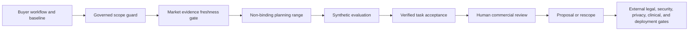

# SCRIMED Commercial Pricing and Positioning

## Status

This document describes a pre-commercial planning model. Pricing ranges are non-binding and require a named human commercial owner, finance review, exact scope, and applicable legal, privacy, security, clinical, deployment, and customer approvals before an external commitment.

SCRIMED remains synthetic-data and no-PHI by default. Nothing in this model authorizes live clinical care, diagnosis, treatment, payer submission, EHR writeback, production deployment, certification claims, or customer go-live.

## Decision

SCRIMED should not compete as a low-cost clinical scribe subscription. The defensible commercial lane is a staged healthcare intelligence program:

1. Free, inspectable public proof.
2. Paid no-PHI workflow assessment.
3. Paid synthetic pilot with agreed acceptance criteria.
4. Protected enterprise planning only after security, privacy, legal, identity, audit, and tenant review.
5. Annual or multi-year platform terms only after verified pilot evidence and external authorization.

The existing price ladder is retained as a planning range, not a claim that the market has accepted the price. Discounts reduce scope, duration, services, integrations, or support; they do not reduce safety, privacy, evidence, or human-review controls.

## Architecture



`app/lib/commercialStrategy.ts` owns the typed pricing ranges, market evidence, value hypothesis calculator, global profiles, competitive pillars, and scope decision. `/api/commercial/pricing` exposes the read-only model with explicit no-authority headers. `/pricing` renders the buyer-facing decision surface.

## Governed Scope Guard

The browser-only scope guard accepts only bounded structured inputs: engagement goal, workflow count, site count, region count, and whether a protected environment is requested. It returns a planning lane, non-binding range, scope mismatch state, and required human gates.

Counts must be whole numbers. An assessment exceeding three workflows, three sites, or one region fails into human rescoping. A protected-environment request cannot remain in an assessment or ordinary synthetic-pilot lane. The guard cannot create or save a quote, discount, contract, customer record, protected environment, or production authorization.

## Value Model

The browser-only calculator estimates:

- annual manual workflow baseline;
- verified capacity-value hypothesis;
- value-to-cost hypothesis;
- planning break-even period;
- estimated verified workflow count;
- cost per verified workflow.

Only buyer-provided assumptions are used. No inputs are transmitted or stored. Capacity value is not cash savings, revenue, reimbursement, staffing reduction, audited ROI, or a forecast. A governed pilot must validate the baseline, eligible volume, efficiency, acceptance criteria, review burden, implementation cost, and outcome evidence.

## Market Evidence

Market records are dated, first-party public signals with comparison boundaries:

- [Freed official website](https://www.getfreed.ai/) publishes a low-cost self-serve entry point.
- [Heidi official pricing](https://www.heidihealth.com/pricing) publishes free, clinician, and practice subscription tiers and a sales-led enterprise motion.
- [Abridge official product page](https://www.abridge.com/product) presents an EHR-integrated enterprise clinical intelligence platform with linked evidence and contact-sales motion.
- [Redox official website](https://redoxengine.com/) presents consultation-led interoperability infrastructure and managed implementation scope.

These sources do not establish SCRIMED parity, superiority, performance, customer economics, implementation timelines, compliance, or market acceptance. They support only the strategic distinction between self-serve seat pricing and enterprise workflow programs.

Each source has a `lastVerified` date and a `reviewDue` date. Evidence becomes `review-due` during the final fourteen days and `stale` after the due date. Any stale source disables buyer-facing competitive comparison until a human owner reverifies the first-party page and updates the record. This freshness gate protects pricing narratives from silently relying on outdated competitor information.

## Competitive Position

SCRIMED's inspectable differentiation is:

- governed workflow proof before protected implementation;
- model-independent routing and explicit abstention;
- evidence, provenance, verification, and review state;
- interoperability readiness without production writeback authority;
- one governance layer across clinical-support and operational modules;
- an optional FaithCore experience separated from Atlas clinical logic.

This is a product thesis supported by repository artifacts, not a claim of unique market ownership or clinical superiority.

## Global Position

The platform keeps one enterprise thesis while separating regional authority:

- United States: no-PHI workflow assessment and synthetic pilot first.
- UK and EEA: synthetic proof before country-specific privacy, AI, medical-software, procurement, and residency review.
- GCC: executive no-PHI briefing, Arabic and English review, local partner qualification, and sovereignty planning.
- Resource-constrained and mission-oriented organizations: reduced scope, not reduced controls; FaithCore remains optional.

Public ranges remain USD planning references. Currency, tax, procurement, hosting, residency, legal, clinical, and partner terms require qualified regional review.

## Governance Rules

- A fast or inexpensive option cannot compensate for failed safety, privacy, security, or evidence gates.
- Only a named authorized human may issue a quote, discount, contract, or external commitment.
- Competitor information must come from a dated public source and retain a no-copy boundary.
- Stale competitor evidence cannot support buyer-facing comparisons or pricing justification.
- Buyer-specific value claims require baseline, method, owner, acceptance criteria, and review evidence.
- Protected pilots do not inherit production, PHI, clinical, payer, EHR, deployment, or customer authority.
- FaithCore is opt-in and cannot influence diagnosis, treatment, eligibility, prioritization, risk scoring, or access.

## Known Limitations

- Price bands have not been validated through closed customer contracts in this repository.
- No audited cost of delivery, gross-margin history, retention, expansion, or willingness-to-pay dataset exists.
- Competitor enterprise contract prices are generally not public.
- Regional tax, legal, procurement, residency, and clinical requirements remain external review gates.
- Calculator outputs are planning hypotheses and must not enter investor or customer materials as achieved outcomes.

## Next Evidence Milestone

Run three to five founder-approved no-PHI discovery conversations using one consistent scope card. Record buyer segment, workflow volume, current burden, decision criteria, price reaction, required evidence, objections, and next commitment. Finance and the commercial owner should then review the planning bands against delivery cost, sales cycle, willingness to pay, and verified pilot value before any public revision.

## Validation

```bash
npm run test:commercial-pricing
npm run smoke:commercial-pricing
npm run typecheck
npm run lint
npm run test:nonsecret
npm run build
git diff --check
```
