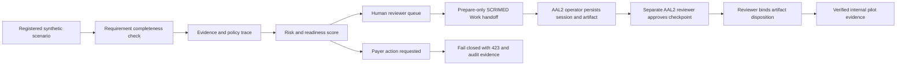

# SCRIMED PayerIQ Documentation-Before-Authorization

## Purpose

PayerIQ is an interactive synthetic workflow that identifies documentation gaps before a prior-authorization packet reaches payer review. It turns a registered scenario into:

- documentation completeness scoring;
- missing-evidence detection;
- policy and source references;
- reviewer ownership and next actions;
- a deterministic audit hash;
- a prepare-only SCRIMED Work Definition-of-Done handoff;
- claims-safe workflow economics assumptions.

The product route is `/documentation-before-authorization`. The public synthetic GET/POST API is `/api/documentation-before-authorization`. The protected handoff is `POST /api/documentation-before-authorization/scrimed-work-handoff`.

## Input Contract

The public workbench accepts only registered scenario IDs, registered documentation-requirement IDs, a bounded reviewer state, a bounded workbench action, and an explicit data-boundary acknowledgement. It does not accept free text, uploaded records, payer-member identifiers, policy credentials, raw connector payloads, or PHI.

Unknown fields, token-like fields, malformed JSON, oversized payloads, unregistered requirements, and missing boundary acknowledgement fail closed.

## Execution Flow



## Safety Boundary

- Synthetic/no-PHI only.
- No medical-necessity determination.
- No diagnosis, treatment, prescribing, or live clinical care.
- No payer contact, prior-authorization submission, appeal filing, or claim submission.
- No patient outreach or EHR writeback.
- No reimbursement, denial-reduction, ROI, certification, or customer go-live claim.
- Human review remains required for every result.
- Packet export and external distribution remain disabled; this implementation exposes no release path.
- Internal review does not authorize packet export, external distribution, payer submission, EHR writeback, or customer use.

## Protected Handoff

The protected handoff accepts the same enumerated synthetic scenario metadata as the public workbench and requires `reviewerStatus=queued`. A browser-selected reviewed state is never treated as authority. The route additionally requires the SCRIMED Work durable-store flags, reviewed migration evidence, tenant workspace scope, a mutation idempotency key, and an authenticated AAL2 tenant member.

It creates a high-risk, prepare-only revenue-cycle work session plus a `prior-authorization-draft` artifact. A different AAL2 member with the `reviewer` role must approve the session checkpoint and review the artifact. The database recomputes the reviewer identity and decision hashes, locks the authoritative records, reruns verification, and synchronizes the reviewed artifact into the durable session. Only then can the protected internal completion transition run.

This lifecycle is evidence binding for internal synthetic use. It is not payer submission, medical-necessity determination, external distribution, or live customer authorization.

## Commercial Use

The workbench is registered as the PayerIQ Documentation Readiness Demo and maps to the 60-Day Governed Automation Pilot. Pilot measurement should use buyer-approved baselines for documentation completeness, reviewer effort, evidence trace quality, rework, and escalation behavior. Synthetic time estimates are assumptions, not savings claims.

## Validation

```bash
npm run smoke:documentation-before-authorization
npm run test:scrimed-work:artifact-review-policy
npm run smoke:scrimed-work:durable-store-preflight
npm run typecheck
npm run lint
npm run test:nonsecret
npm run build
```

Production data, payer connections, and consequential actions require separate security, privacy, clinical, legal, customer, connector, and release approvals. This implementation grants none of those authorities.
