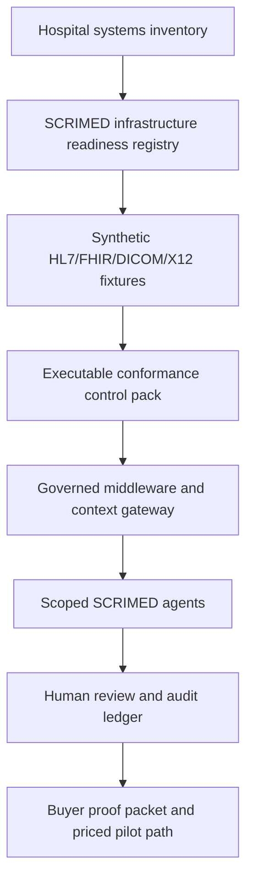

# SCRIMED Enterprise Healthcare Infrastructure Readiness

SCRIMED Enterprise Healthcare Infrastructure Readiness is a synthetic/metadata-only control plane for translating hospital IT reality into governed SCRIMED product, pilot, diligence, and revenue paths.

It maps:

- FHIR and HL7 v2 ADT/ORM/ORU readiness
- DICOM, DICOMweb, PACS, RIS, HIS, and VNA imaging workflow readiness
- X12, prior authorization, claims, appeals, and RCM workflow readiness
- Integration Engines, REST/webhook/queue patterns, and MCP/A2A-ready middleware
- VPNs, Firewalls, Customer VPC, Virtual Machines, edge runtime, databases, and audit ledgers
- Agent orchestration, human review, proof packets, and buyer/investor evidence routes

## Why It Matters

Enterprise healthcare buyers do not only buy AI answers. They evaluate whether a platform can fit into clinical, operational, imaging, payer, security, and infrastructure environments without creating unsafe data movement or unreviewed automation.

This layer turns SCRIMED's strategy into an inspectable readiness map:

- CIO/CMIO buyers can see how SCRIMED handles hospital systems before PHI is requested.
- Radiology leaders can see imaging workflow support without final interpretation claims.
- RCM leaders can see documentation-before-authorization and payer-readiness value without payer submission.
- Security and procurement reviewers can see VPN/firewall/private-runtime assumptions before pilot scoping.
- Investors can see how SCRIMED becomes healthcare infrastructure, not a basic chatbot.

## Architecture



## Hospital Integration Conformance Control Pack

The control pack converts standards claims into executable synthetic evidence. It currently combines:

- FHIR R4 and deployment-selected profile validation readiness
- SMART App Launch authorization readiness
- HL7 v2 ADT, ORM, and ORU event-profile readiness
- DICOMweb metadata, service, pixel-separation, and conformance-statement readiness
- X12 payer and RCM evidence readiness

Each kit attaches a contract, synthetic fixture, deterministic checks, source references, required evidence, review owner, and explicit live blockers. A kit can pass synthetic checks while remaining `live-blocked`; this is intentional. Static validation cannot prove production interoperability, and partner testing, identity, consent, purpose-of-use, network controls, durable audit, and qualified review remain mandatory.

The commercial package is a fixed-scope Hospital Integration Conformance Readiness assessment. Its safe expansion path is:

1. No-PHI systems discovery.
2. Synthetic conformance sprint.
3. Human-reviewed evidence packet.
4. Protected no-PHI pilot.
5. Partner acceptance planning.
6. Separately approved enterprise integration.

It does not authorize a production interface-engine channel, FHIR write, DICOM transfer, payer transaction, EHR/PACS/RIS/HIS mutation, or customer go-live.

## Competitive Patterns Applied Independently

SCRIMED uses public, lawful market research to identify architecture patterns, then implements original controls in the SCRIMED codebase:

- [Oracle Health Clinical AI Agent](https://www.oracle.com/health/clinical-suite/clinical-ai-agent/) emphasizes unified clinical, operational, and financial context with workflow orchestration and explainable outputs. SCRIMED applies this as a governed evidence envelope spanning context, workflow, TrustOps, and revenue-cycle modules.
- [Aidoc aiOS](https://www.aidoc.com/platform/aios/) emphasizes one integration surface, orchestration, governance, validation, drift, override tracking, and impact analytics. SCRIMED applies this as one cross-standard conformance control pack with no-authority defaults.
- [Microsoft healthcare agent service](https://learn.microsoft.com/en-us/azure/health-bot/overview) emphasizes a healthcare-adapted orchestrator grounded in customer-controlled sources. SCRIMED applies this through source provenance, untrusted-content handling, model-neutral routing, and governed context adapters.
- [IHE Profiles](https://www.ihe.net/resources/profiles/) give buyers precise actors, transactions, and conformance language. SCRIMED applies this through versioned contracts, synthetic fixtures, deterministic evaluations, evidence lists, and live blocker sets.

SCRIMED does not copy proprietary code, prompts, algorithms, customer data, regulated claims, copyrighted product copy, or confidential implementation details. Public market patterns are used only to guide independently authored architecture and buyer-safe positioning.

Primary conformance references include [FHIR R4 validation](https://hl7.org/fhir/R4/validation.html), the [DICOM standard and conformance materials](https://www.dicomstandard.org/current), [IHE Profiles](https://www.ihe.net/resources/profiles/), and [X12 healthcare resources](https://x12.org/products/health-care).

## Safety Boundaries

This capability does not authorize:

- Live PHI, ePHI, source charts, patient identifiers, or raw connector payloads
- Autonomous diagnosis, treatment, prescribing, triage, patient outreach, or final imaging interpretation
- EHR writeback, PACS/RIS/HIS mutation, payer submission, claim filing, prior-authorization submission, or billing submission
- Production connector approval for HL7, FHIR, DICOM, DICOMweb, X12, VPN, Virtual Machines, databases, firewalls, or integration engines
- HIPAA, SOC 2, HITRUST, FDA, ONC, clinical validation, customer go-live, revenue guarantee, or security assurance claims

## Buyer Motion

Use this as an enterprise proof asset:

1. Run a no-PHI hospital IT discovery call.
2. Map systems to SCRIMED capability lanes.
3. Select one synthetic workflow: ADT context, imaging operations, documentation-before-authorization, private runtime, or audit ledger.
4. Produce a claims-safe proof packet.
5. Convert to a paid readiness assessment or synthetic pilot.
6. Preserve live connector, PHI, clinical, payer, security, and customer go-live gates until qualified approvals exist.

## No-PHI Discovery Intake

The discovery intake accepts only metadata and synthetic examples:

- system names and high-level owners
- workflow purpose
- event/resource names
- modality categories
- deployment preferences
- reviewer roles
- success metric definitions

It rejects:

- patient identifiers
- production exports
- raw HL7/FHIR/DICOM/X12 payloads
- screenshots with PHI
- VPN credentials
- database credentials
- API keys
- firewall rule exports
- payer portal credentials

## Scoped Pilot Packages

SCRIMED can use the readiness map to frame no-PHI pilots:

- HL7/FHIR Context Sprint
- DICOM/PACS/RIS Operations Sprint
- X12 / RCM Evidence Sprint
- Private Runtime Readiness Sprint
- Audit Ledger / Trust Evidence Sprint

Each pilot must preserve one measurable outcome, one proof packet, one commercial motion, one human review lane, and one retained boundary.

## Pilot Recommendation Engine

The deterministic pilot recommendation engine evaluates metadata-only buyer signals:

- buyer role
- systems mentioned
- workflow priorities
- deployment constraints
- desired outcome

It returns:

- one recommended no-PHI pilot
- runner-up pilots
- required discovery questions
- required proof-packet artifacts
- revenue motion
- retained NO-GO boundaries
- audit hash

This selector is intentionally not an autonomous sales, clinical, security, or implementation approval system. It is a routing aid for human-reviewed scoping.

## Buyer Packet Composer

The buyer packet composer turns each recommendation into:

- meeting agenda
- demo sequence
- decision criteria
- required proof artifacts
- follow-up outline
- commercial positioning
- blocked claims
- next safe human action

Packets are designed for CIO/CMIO, radiology operations, RCM/CFO, security/procurement, and investor diligence conversations. They are not contracts, statements of work, quotes, security approvals, clinical approvals, production connector approvals, or customer go-live approvals.

## Decision Readiness Scorecards

Decision readiness scorecards translate each buyer packet into measurable, human-reviewed evidence:

- procurement readiness score
- security review score
- clinical safety score
- commercial readiness score
- evidence completeness score
- required next evidence
- blocked decision reasons
- executive decision prompt
- safe close plan
- audit hash

These scorecards help SCRIMED keep enterprise sales motion concrete: every buyer conversation should end with a clear next safe action, a named review path, one measurable synthetic outcome, and explicit retained boundaries. Production authority remains false.

## Procurement Action Plans

Procurement action plans convert each decision scorecard into an operator-ready workflow:

- owner roles
- gate sequence
- target follow-up window
- evidence to collect
- blockers to resolve
- escalation trigger
- completion criteria
- safe operator script
- handoff artifacts

The plans are designed to help SCRIMED move enterprise buyers from interest to governed no-PHI pilot scoping without drifting into unauthorized PHI processing, production connector access, payer submission, clinical authority, certification claims, or customer go-live language.

## Proof Packet Checklist

Every external packet should include:

- no-PHI infrastructure discovery intake
- FHIR/HL7/DICOM/X12 standards scope map
- VPN/firewall/VM/private-runtime review worksheet
- synthetic pilot acceptance criteria
- boundary and approval card

## Validation

Run:

```bash
npm run smoke:enterprise-healthcare-infrastructure
npm run test:nonsecret
npm run typecheck
npm run lint
npm run build
```

This is infrastructure readiness only. It is not production connector approval, clinical validation, a certification claim, live-care authority, payer authority, customer go-live approval, or a substitute for qualified legal, security, clinical, reimbursement, or procurement review.
