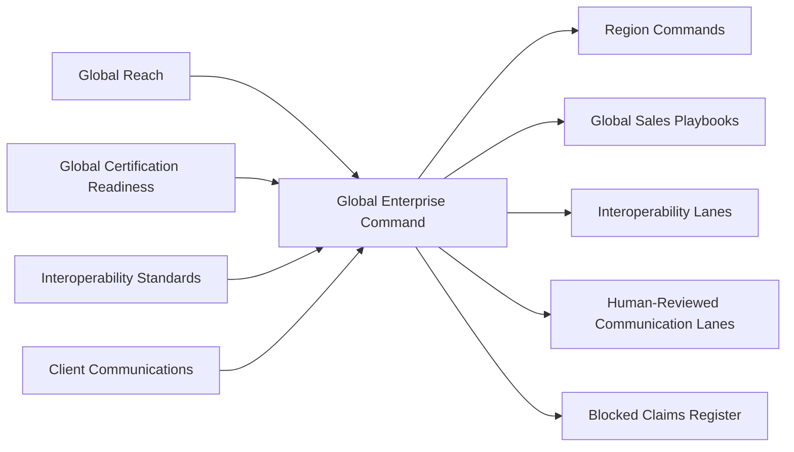

# SCRIMED Global Enterprise Command

SCRIMED Global Enterprise Command is a metadata-only control plane for international enterprise readiness. It coordinates global sales, localization, interoperability, communication, certification-readiness evidence, and partner qualification without granting legal, clinical, procurement, security, or production authority.

## Purpose

- Convert global interest into region-specific no-PHI proof packets.
- Align buyer messaging with retained legal, privacy, clinical, security, procurement, and production gates.
- Tie international sales playbooks to proof routes, region commands, and human-reviewed communication.
- Keep interoperability standards synthetic until profiles, licenses, deployment regions, and customer authority are approved.
- Make blocked claims visible before investor, buyer, partner, public-sector, or international outreach.

## Safety Boundary

This layer does not authorize live PHI, production deployment, clinical care, diagnosis, treatment, prescribing, payer submission, EHR writeback, public-sector procurement approval, reseller authority, revenue guarantees, certification claims, or customer go-live.

## Architecture

## Operating Model

1. Select the region command and buyer audience.
2. Use the sales playbook to choose the right no-PHI offer and proof route.
3. Attach global certification-readiness gates and blocked claims.
4. Attach interoperability assumptions for FHIR, HL7, DICOM, X12, terminology, or regional exchange needs.
5. Draft communication from approved templates only.
6. Require human review before external send, partner claims, pricing commitments, legal statements, clinical statements, or production commitments.

## Validation

- `npm run smoke:global-enterprise-command`
- `npm run test:nonsecret`
- `npm run smoke:public`
- `npm run typecheck`
- `npm run lint`
- `npm run build`
