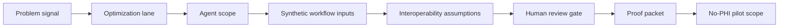

# SCRIMED Healthcare Optimization Command

SCRIMED Healthcare Optimization Command is a synthetic-only operating layer that turns SCRIMED problem solving into domain-specific healthcare optimization lanes.

It coordinates:

- clinical workflow optimization;
- patient engagement analysis;
- hospital operations intelligence;
- interoperability planning;
- agent capability expansion;
- innovation intake;
- health-tech solution packaging.

## Why It Matters

SCRIMED should not behave like a narrow chatbot. The platform should act as a governed healthcare intelligence operating system that helps teams identify operational friction, map evidence, assign owners, assemble review packets, and package solutions without crossing clinical or production authority boundaries.

## Safety Boundary

This layer does not authorize live PHI, autonomous clinical care, diagnosis, treatment, prescribing, patient outreach, payer submission, EHR writeback, final imaging interpretation, production connector approval, production deployment, certification claims, valuation assurance, revenue guarantees, profit guarantees, or customer go-live.

## Operating Model

## Validation

- `npm run smoke:healthcare-optimization-command`
- `npm run test:nonsecret`
- `npm run smoke:public`
- `npm run typecheck`
- `npm run lint`
- `npm run build`
