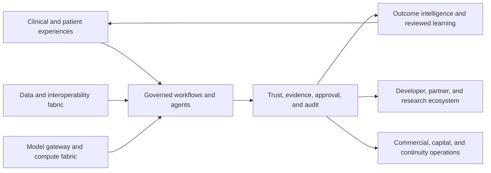

# SCRIMED Platform Map

**Status:** Internal diligence preparation; synthetic/no-PHI foundation only
**Source of truth:** `app/lib/scrimed-control-plane/platformStrategy.ts`
**Machine-readable artifact:** `artifacts/platform/platform-map.json`

SCRIMED is organized as one governed healthcare work and intelligence platform. Models are
replaceable components. The durable platform assets are the workflow contracts, healthcare
semantics, evidence, evaluations, policy enforcement, provenance, human-review controls, and
outcome-learning infrastructure.

## Eleven Planes

| Plane | Platform responsibility |
| --- | --- |
| Clinical experience | Role-specific, cited, human-reviewed workflow support |
| Workflows and agents | Bounded planner-specialist-verifier execution |
| Data and interoperability | FHIR, HL7, DICOM metadata, document, and provenance contracts |
| Model and compute | Provider-neutral routing by validated fit, risk, privacy, latency, and effective cost |
| Trust and governance | Policy-before-action, evidence, approval, audit, cancellation, and rollback |
| Evidence and learning | Baselines, accepted outcomes, corrections, regression cases, and reviewed promotion |
| Developer ecosystem | Read-only schemas, fixtures, manifests, and conformance checks |
| Partner marketplace | Future governed admission path; disabled pending legal and security review |
| Research and trials | Source-grounded research preparation with no enrollment authority |
| Business and capital | Claims-safe buyer, pricing, diligence, and investor preparation |
| Operations and continuity | Ranked safe actions, blocker ownership, provenance, and recovery evidence |

Every registered capability declares an owner, risk tier, environments, required approvals,
data and model classes, tool classes, evidence, jurisdiction constraints, activation and public
claim status, dependencies, customer types, monetization path, moat contribution, feature flag,
and audit fingerprint.

## Platform Metrics

The platform defines three first-class economic and quality measures:

1. **Verified intelligence yield:** reviewer-accepted, mandatory-verification outputs divided by
   all attempts, including failures, abstentions, retries, and rejections.
2. **Healthcare value returned:** approved evidence of operational, financial, patient, or
   clinical value divided by total verified workflow cost.
3. **Cost per verified successful task:** provider, infrastructure, retrieval, validation,
   reviewer, retry, latency, and failure cost divided by tasks meeting mandatory acceptance gates.

Current values are deliberately `null`: no approved baseline or customer outcome evidence has
been collected. They are not clinical accuracy, ROI, savings, revenue, valuation, or production
reliability claims.

## Boundary

This map does not authorize live PHI, autonomous clinical care, diagnosis, treatment,
prescribing, payer submission, EHR writeback, medical-device connectivity, production
deployment, certification claims, customer activation, investor outreach, or valuation claims.
