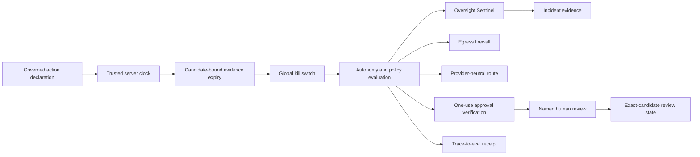

# p.34 Control Plane 2.0 Architecture

SCRIMED p.34 extends the existing `app/lib/scrimed-p34` control plane. It does not create a second runtime.

The current release ceiling is `EXACT_REVIEW_REQUIRED`. `READ_ONLY` is the default kill-switch mode. A3, external side effects, production writes, PHI, provider calls, migrations, customer activation, and distribution remain unavailable.

## Data Flow

1. An action declares tenant, actor hash, candidate, autonomy, risk, classification, environment, evidence, tools, models, rollback, side-effect class, jurisdiction, maturity, and expiry.
2. Server-owned time validates the declaration and evidence. Caller timestamps are not authority.
3. Evidence must match the exact candidate and remain unexpired.
4. The kill switch constrains the action before autonomy or routing. `HALTED` blocks every new governed action, including reads.
5. Runtime validation rejects unknown schema, autonomy, risk, classification, approval, maturity, rollback, side-effect, and kill-switch values before policy evaluation.
6. Policy denies undeclared tools/models, environment or jurisdiction drift, PHI, prohibited risk, maturity inflation, and external side effects. A declared human approval can never produce `ALLOW`.
7. Approval verification is schema, exact-scope, signature, trusted-time, trust-class, and one-use bound. Verifier or store failure returns a structured block. The local in-memory store is synthetic-only and never grants execution authority.
8. Egress requires an explicit data classification, bounded traversal, and a complete inspection. PHI, secrets, unknown classifications, cyclic data, and unsupported payloads fail closed without echoing raw input.
9. The trace accepts bounded identifiers, SHA-256 evidence, and finite telemetry only. It stores fingerprints, decisions, tools, evidence, latency, and cost, never PHI, secrets, or hidden chain-of-thought.
