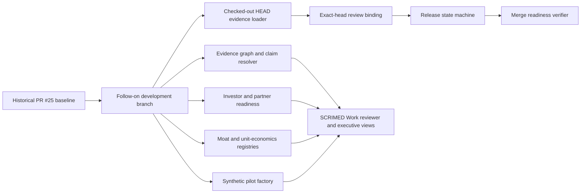

# Post-PR25 Platform Advance

## Architecture



## Controls

- Exact review requires a trusted identity result, exact commit and evidence fingerprints, critical-surface fingerprints, required evidence, expiry, digest integrity, separation of duties, and replay protection.
- Release transitions are explicit and require evidence at each stage.
- Merge preflight reports readiness but cannot merge.
- The evidence graph verifies node/edge integrity and blocks unsupported public claims.
- Investor and partner scores are internal planning tools, not predictions, guarantees, or relationship claims.
- Economic outputs retain `UNAVAILABLE` rather than inventing revenue, margin, payback, or value.
- The pilot factory is synthetic/no-PHI and cannot submit, write back, or activate a customer.

### Merge-readiness approval evidence

`release:merge-readiness` never infers exact-head approval from a boolean or reuses the historical PR #25 candidate. Before evaluating an approval, it reconstructs the candidate from the clean checked-out Git commit and tree, strict candidate manifest, strict validation evidence, complete review packet, deterministic SBOM, and current deployment configuration. Every source commit, tree, candidate, source, validation, review-packet, and SBOM value must align. The SBOM dependency delta is calculated against the exact reviewed candidate base, never the checked-out `HEAD`, and the base SHA is part of the SBOM evidence. It then evaluates the complete approval artifact against that current candidate with `evaluateExactHeadReviewBinding`, and accepts reviewer identity only after Ed25519 verification against a configured trusted issuer. An approval for PR #25 or any earlier head therefore fails with `exact-head-review-stale`.

Set `SCRIMED_RELEASE_CANDIDATE_BASE_REF` to the exact reviewed ancestor used to generate the candidate packet before running merge readiness. The loader passes the same base through all deterministic evidence commands. A missing or different base produces different fingerprints and fails closed rather than reinterpreting an approval. The evidence loader runs the strict local candidate suite; remote CI and named human review remain separately observed release controls and are never inferred from the historical baseline.

Generate the non-authorizing reviewer input for the checked-out head with:

```text
SCRIMED_RELEASE_CANDIDATE_BASE_REF=<exact-reviewed-base> npm run release:merge-readiness -- --candidate-only
```

The output contains hash-only candidate, validation, review-coverage, required reviewer roles, all commit-author identity fingerprints, SBOM, and critical-surface evidence. Candidate author identities are normalized in both Git-author and GitHub-subject namespaces when available so a trusted issuer can reject review evidence from any candidate author. Any source change invalidates the packet and requires a new packet and a fresh independent review.

Provide the local, nonsecret signed envelope through `SCRIMED_EXACT_HEAD_APPROVAL_FILE` or `--approval-file <path>`. The envelope contains `approval` plus one `identityEvidence` payload and its short-lived issuer attestation. The signed payload must contain exactly one exact-head approval, one current `named-reviewer-approval` disposition for every required review-packet role, one trusted identity mapping for each unique reviewer, and one `exact-head-remote-ci` receipt. Identity mappings must carry every comparable reviewer identity known to the trusted issuer; an alias matching any candidate author fails as self-review. Every item must match the exact commit, candidate, source, validation, and review-packet fingerprints; the remote-CI receipt must use `protected-remote-ci` identity assurance. Passing local validation does not satisfy the remote CI gate. Configure approved public keys and issuer scope through `SCRIMED_P32_EVIDENCE_TRUSTED_PUBLIC_KEYS_JSON`; the trusted issuer must be scoped to these precise evidence IDs and approval gates, and private keys never belong in this verifier or repository.

Strict evaluation also requires `SCRIMED_EXACT_HEAD_CONSUMPTION_LEDGER_DIR`, pre-provisioned as an absolute, access-controlled directory that is not group- or world-writable. Every ancestor must be root-owned and non-writable by the non-root verifier identity; common temporary and user-home paths are intentionally rejected because they can be renamed during consumption. The verifier holds an open directory descriptor, checks device/inode continuity around every marker write, syncs each hash-only mode-`0600` marker, and syncs the directory before reporting success. Identifier keys are version-independent, while every supported v1/v2 marker alias is both inspected and reserved during a new consumption so rolling upgrades cannot make an earlier approval appear unused. Reusing the approval ID or replay nonce fails closed across later processes. For a controlled merge, place this directory on the approved durable audit volume; the local adapter is not a substitute for the protected candidate-review ledger or release authority. Missing, unreadable, malformed, unsigned, untrusted, stale, expired, future-dated, replayed, self-issued, digest-mismatched, unsupported-disposition, renameable-path, unsynced, or otherwise unsafe-ledger evidence fails closed. A GitHub review is human evidence, but it is not silently converted into the local cryptographic approval contract.

## Validation

Run:

```text
npm run test:exact-head-review-binding
npm run test:release-state-machine
npm run test:merge-readiness
npm run test:post-pr25-platform-advance
npm run evidence:post-pr25-platform
npm run evidence:post-pr25-platform:check
npm run typecheck
npm run lint
npm run test:nonsecret
npm run build
git diff --check
```

The follow-on branch grants no review, merge, production, migration, PHI, clinical, payer, EHR, device, certification, customer, partnership, investor-distribution, or commercial authority.
