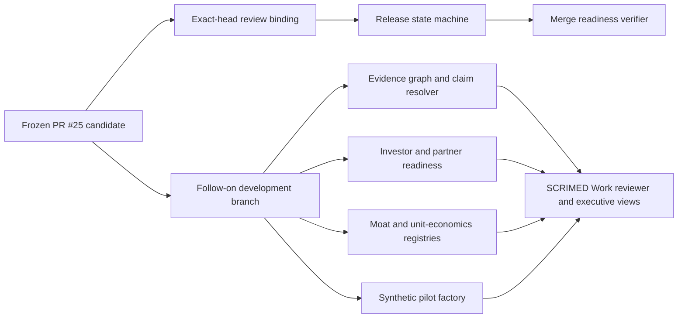

# Post-PR25 Platform Advance

## Architecture



## Controls

- Exact review requires a trusted identity result, exact commit and evidence fingerprints, critical-surface fingerprints, required evidence, expiry, digest integrity, separation of duties, and replay protection.
- Release transitions are explicit and require evidence at each stage.
- Merge preflight reports readiness but cannot merge.
- The evidence graph verifies node/edge integrity and blocks unsupported public claims.
- Investor and partner scores are internal planning tools, not predictions, guarantees, or relationship claims.
- Economic outputs retain `UNAVAILABLE` rather than inventing revenue, margin, payback, or value.
- The pilot factory is synthetic/no-PHI and cannot submit, write back, or activate a customer.

### Merge-readiness approval evidence

`release:merge-readiness` never infers exact-head approval from a boolean in the frozen baseline. It evaluates a complete approval artifact against the frozen candidate with `evaluateExactHeadReviewBinding`, and it accepts reviewer identity only after Ed25519 verification against a configured trusted issuer.

Provide the local, nonsecret signed envelope through `SCRIMED_EXACT_HEAD_APPROVAL_FILE` or `--approval-file <path>`. The envelope contains `approval` plus one `identityEvidence` payload and its short-lived issuer attestation. Configure approved public keys and issuer scope through `SCRIMED_P32_EVIDENCE_TRUSTED_PUBLIC_KEYS_JSON`; private keys never belong in this verifier or repository. Missing, unreadable, malformed, unsigned, untrusted, stale, expired, future-dated, replayed, self-issued, digest-mismatched, or unsupported-disposition evidence fails closed. A GitHub review is human evidence, but it is not silently converted into the local cryptographic approval contract.

## Validation

Run:

```text
npm run test:exact-head-review-binding
npm run test:release-state-machine
npm run test:merge-readiness
npm run test:post-pr25-platform-advance
npm run evidence:post-pr25-platform
npm run evidence:post-pr25-platform:check
npm run typecheck
npm run lint
npm run test:nonsecret
npm run build
git diff --check
```

The follow-on branch grants no review, merge, production, migration, PHI, clinical, payer, EHR, device, certification, customer, partnership, investor-distribution, or commercial authority.
