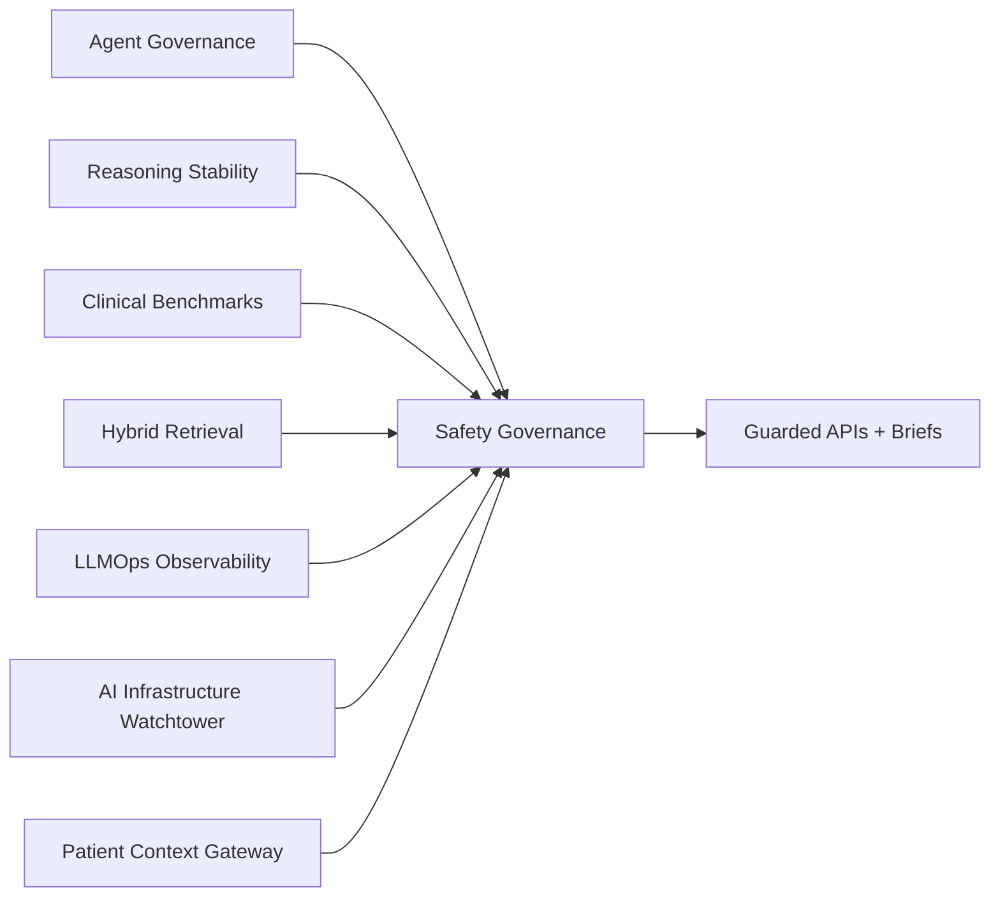

# SCRIMED CODE pt. 4

SCRIMED CODE pt. 4 adds seven synthetic/no-PHI healthcare intelligence infrastructure layers to the SCRIMED platform.

## Added Surfaces

- `/scrimed-agent-governance`
- `/scrimed-reasoning-stability`
- `/scrimed-clinical-benchmark-suite`
- `/scrimed-hybrid-retrieval`
- `/scrimed-llmops-observability`
- `/scrimed-ai-infrastructure-watchtower`
- `/scrimed-patient-context-gateway`

## Architecture

## Safety Boundary

All CODE pt. 4 surfaces are metadata-only or synthetic-only. They do not authorize PHI, autonomous clinical care, diagnosis, treatment, prescribing, patient outreach, payer submission, EHR writeback, production deployment, certification claims, or customer go-live claims.

## Validation

Use `npm run smoke:scrimed-code-pt-4` for the complete CODE pt. 4 contract check.
