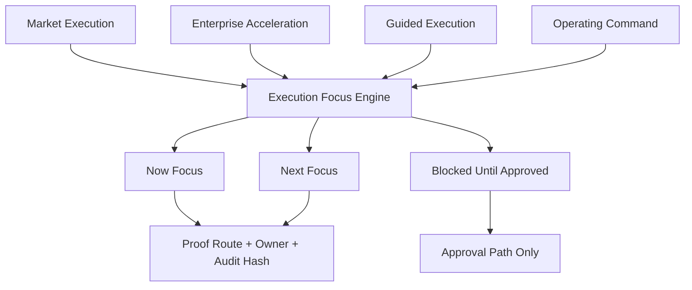

# SCRIMED Execution Focus Engine

SCRIMED Execution Focus Engine ranks the next safe build, sales, diligence, security, and operating actions across the platform. It is designed to keep SCRIMED moving toward revenue and investor confidence without weakening the current clinical, privacy, compliance, and production hard stops.

## Why It Matters

SCRIMED now has many product, trust, infrastructure, investor, and workflow surfaces. The next strategic risk is fragmentation: building more modules while the highest-value proof, revenue, trust, and operating actions are not obvious. The focus engine makes the operating queue explicit.

## Architecture



## Scoring

Each focus item includes:

- lane
- horizon
- source system
- objective
- why now
- owner
- proof route
- API route
- next action
- value score
- risk score
- effort score
- focus score
- human review requirement
- retained boundary
- blocked actions
- audit hash

The score weights value most heavily, then risk reduction, then effort. Blocked work is capped so it remains visible without crowding out work SCRIMED can safely execute today.

## Safety Boundary

This layer is synthetic and metadata-only. It does not grant live patient-data authority, clinical authority, payer submission authority, EHR mutation authority, certification claims, investment advice, revenue guarantees, or customer go-live approval.

## Validation Commands

```bash
npm run smoke:scrimed-execution-focus
npm run test:nonsecret
npm run typecheck
npm run lint
npm run build
```

## Recommended Operating Use

Use the `now` queue for weekly execution, the `next` queue for roadmap sequencing, and the `blocked` queue for approval-path evidence work. Do not treat a high focus score as approval to cross a retained safety boundary.
