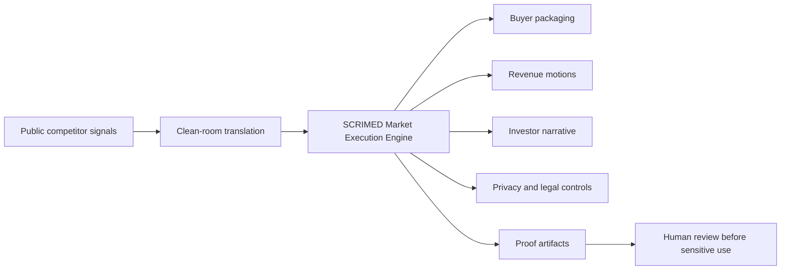

# SCRIMED Market Execution Engine

Reviewed: 2026-07-08

SCRIMED Market Execution Engine converts public, clean-room competitive research into original SCRIMED product packaging, proof artifacts, sales motions, revenue levers, privacy controls, public-relations language, and investor narratives.

It is synthetic/business-metadata only. It does not authorize PHI, live patient data, autonomous clinical care, diagnosis, treatment, prescribing, imaging interpretation, EHR writeback, payer submission, billing submission, production connector approval, certification claims, customer go-live, or competitor proprietary copying.

## Why It Matters

Competitor research is only valuable if it becomes disciplined execution. This layer turns public market signals into SCRIMED-owned actions:

- buyer demo positioning
- investor proof routes
- sales follow-up language
- revenue packaging
- privacy and legal review controls
- public relations messaging
- implementation sprints
- audit hashes and retained boundaries

## Architecture



## Clean-Room Rules

- Use public sources only.
- Translate patterns into original SCRIMED strategy.
- Do not copy code, UI, branding, private APIs, datasets, customer proof, pricing sheets, model weights, security reports, or proprietary workflows.
- Do not imply competitor partnership, compatibility, certification, customer adoption, or product parity.
- Bind every sales or investor message to a SCRIMED proof route and a retained boundary.

## Execution Lanes

The engine currently creates lanes for:

- proof-before-pilot command
- trust center as sales asset
- connector trust catalog
- payer policy evidence loop
- imaging-to-action without interpretation
- audience-specific revenue packaging

Each lane includes target audience, product system, sales motion, revenue lever, investor narrative, privacy/legal control, public-relations positioning, proof artifact, implementation sprint, human review requirement, blocked actions, and audit hash.

## Safety Boundary

This module supports market execution only. It does not provide legal advice, securities material, tax advice, audited financial reporting, reimbursement assurance, valuation assurance, clinical validation, security certification, PHI authority, or customer launch approval.

## Validation Commands

```bash
npm run smoke:scrimed-market-execution
npm run test:nonsecret
npm run typecheck
npm run lint
npm run build
```
