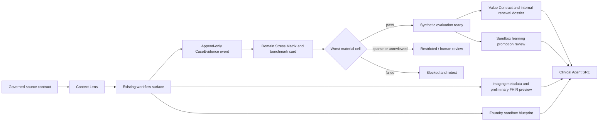

# SCRIMED P31 Applied Intelligence

SCRIMED P31 extends existing workflow, evidence, evaluation, interoperability, model-routing, agent, and value controls. The implementation is synthetic/no-PHI and does not authorize clinical care, payer action, EHR mutation, production connectors, certification claims, or customer go-live.

## Context Lens

The shared `ContextPacket` supports two isolated modes:

- `public-evidence`: public sources only, no tenant clinical context, no PHI, and no patient-specific action.
- `clinical-context`: authenticated, tenant-scoped, minimum-necessary, consent-aware, human-reviewed metadata or synthetic-deidentified context only.

Every packet carries tenant/workflow/actor/purpose metadata, subject hash, relevant history, patient-fit state, evidence, citations, provenance, freshness, missing data, confidence, calibration, contraindications, policy constraints, review level, abstention reason, model/prompt/tool/policy/retrieval versions, and trace identifiers. Missing, stale, contradictory, unverified, or low-confidence evidence triggers abstention or review. Live PHI remains disabled.

PayerIQ at `/documentation-before-authorization` is the first embedded Context Lens surface.

## Evidence From First Case

Every accepted synthetic PayerIQ run emits a deterministic `CaseEvidencePacket` and append-only `CaseEvidenceEvent` with:

- hashed tenant, site, case, and workflow-case identity;
- cohort, eligibility, baseline/comparator, intervention, and event timestamps;
- complete source and model/prompt/tool/policy version lineage;
- reviewer action, override, workflow disposition, descriptive outcomes, and patient-reported outcome slots;
- safety events, missingness, confounders, site/subgroup attributes, latency, utilization, adoption, and cost per accepted outcome;
- trace/correlation identifiers, consent/DUA/aggregation posture, analysis-plan state, Trust QA state, and completeness score.

`InMemoryCaseEvidenceEventStore` proves append ordering, idempotency, integrity, and tenant-scoped reads for local tests. It is deliberately not durable production storage. The packet never exposes a raw case identifier, permits no external distribution, and fixes `causalClaimAllowed` to `false`.

## Domain Stress Matrix

The Clinical Benchmark Suite evaluates task x disease/subtype x subgroup x site x modality x language x workflow-state cells. The release decision is controlled by the worst material cell.

Sparse cells are restricted. Failed evidence or metric thresholds block release. High-risk cells without completed human review stay review-gated. The internal benchmark card emits cell-specific model eligibility and uncertainty labels. A global average cannot override a weak cell, and a model validated in one cell inherits no authority in another.

The Clinical Robustness Lab now covers split records, repeated keys, page breaks, long-range evidence, duplicate summaries, silently merged records, phantom records, corrupted or missing pages, stale evidence, and citation mismatch.

## Imaging Workflow Intelligence Adapter

`imagingWorkflowIntelligence.ts` extends the existing DICOMweb fixture and conformance layer. It accepts synthetic metadata with no pixel data, validates protocol series and measurement units, detects missing series/measurements, records review/correction/override metadata, calculates descriptive fleet variance, and produces preliminary FHIR R4 previews for `ImagingStudy`, `DiagnosticReport`, `Observation`, and `Provenance`.

Diagnostic finalization, report signing, pixel interpretation, external specialist communication, EHR writeback, and live PACS/RIS/VNA connectivity are structurally blocked. `SCRIMED_EXTERNAL_IMAGING_ADAPTERS_ENABLED` defaults to `false`.

## Outcome/Lab-in-the-Loop

The existing SCRIMED Work learning loop now supports:

`hypothesis -> proposed action -> authorization -> execution -> measurement -> feedback classification -> updated hypothesis -> next action -> promotion review`

No-feedback, randomized-feedback, and measured-feedback arms are explicit. Execution requires sandbox authorization. Promotion requires a fixed evaluation set, capability threshold, feedback provenance, human review, passed canary, and tested rollback. A passing review grants no deployment authority and cannot modify a clinical production agent online.

## Clinician-to-Agent Foundry

The Foundry extends SCRIMED Work, Agent Commander, and the existing tool registry. A definition declares data, tools, actions, blocked actions, evidence, escalation, owners, metrics, timeout, retries, and rollback. It generates a deny-by-default permissions manifest, synthetic adversarial set, observability plan, Trustworthiness Case, blocked deployment manifest, canary plan, and ownership record.

The first template is Prior Authorization Evidence Assembly. Its only allowed tool is the review-gated artifact draft tool. Payer submission, EHR writeback, live PHI, diagnosis, treatment, prescribing, outreach, and final imaging interpretation remain mandatory blocked actions. Promotion requires LAMB governance, Trust QA, worst-cell testing, integration validation, sign-off, named ownership, canary configuration, and tested rollback.

## Multi-Model Value Routing

The SCRIMED Work router now evaluates validated domain-cell eligibility, quality floor, sample sufficiency, privacy, residency, availability, full workflow cost, expected accepted-outcome rate, and bounded fallback policy. Full cost can include retrieval, cache, hosting, reserved capacity, observability, validation, maintenance, retries, and human review.

Missing eligibility returns `abstained-no-eligible-model`. No fallback may be silent or weaken privacy, residency, safety, or cell-validation requirements.

## Clinical Agent SRE

The SRE control evaluates workload and tenant isolation, signed model/tool artifacts, least-privilege credentials, queue capacity and age, timeout, bounded retries, circuit state, synthetic failover testing, availability, p50/p95/p99 latency, error/retry/override/abstention rates, safety events, worst-cell status, evidence completeness, and cost per accepted outcome.

Telemetry containing PHI-like fields, credentials, raw prompts, or chain-of-thought is blocked. Only decision summaries, evidence, tool activity, policy results, versions, and reviewable rationale metadata are retained.

## Value Contract and Renewal Evidence

The PayerIQ Value Contract records baseline, measurable target, operational/executive/clinical owners, safety constraints, adoption plan, 30/60/90-day reviews, evidence requirements, renewal criteria, and termination/rollback conditions.

Renewal dossiers accept only integrity-verified CaseEvidence with an approved synthetic analysis plan and Trust QA approval. Claims are classified as observed fact, association, adjusted analysis, causal claim, or unverified claim. Causal and unverified claims remain blocked, and every dossier is internal-review-only.

## Architecture



## Feature Flags

- `SCRIMED_FOUNDRY_ENABLED=true` enables synthetic blueprint generation.
- `SCRIMED_FOUNDRY_DEPLOYMENT_ENABLED=false` keeps Foundry deployment blocked.
- `SCRIMED_CASE_EVIDENCE_DURABLE_STORE_ENABLED=false` keeps durable CaseEvidence writes blocked.
- `SCRIMED_EXTERNAL_IMAGING_ADAPTERS_ENABLED=false` keeps external PACS/RIS/VNA adapters blocked.
- Existing consequential-action, external-provider, schedule, EHR, payer, and clinical-authority flags remain disabled.

## Clinical Assurance Control Plane

The p.31 control plane now resolves an internal CAL, selects a Sovereign Clinical Enclave, verifies the exact signed Model Passport and artifact digest, evaluates worst-cell eligibility, admits capacity, enforces provider/corporate/infrastructure concentration ceilings, rejects correlated fallbacks, and binds the result to CaseEvidence.

PayerIQ is the first end-to-end vertical slice. Every synthetic review packet now carries assurance, enclave, model/fallback digest, capacity, concentration, routing, validated-cell, queue, retry, and final-disposition evidence. Enforcement is observe-only by default; no provider call or consequential action is enabled.

The local Supabase migration creates private append-only assurance registries and policy events with restrictive RLS and mutation rejection. It has not been applied remotely, and durable writes remain disabled.

## Validation

```bash
npm run test:clinical-evidence-controls
npm run smoke:scrimed-p31
npm run test:scrimed-p31-workstreams
npm run smoke:scrimed-p31-workstreams
npm run test:clinical-assurance-control-plane
npm run contract:clinical-assurance-migration
npm run smoke:clinical-assurance-control-plane
npm run smoke:clinical-context-gateway
npm run smoke:scrimed-clinical-benchmark-suite
npm run smoke:documentation-before-authorization
npm run smoke:clinical-robustness-lab
npm run typecheck
npm run lint
npm run test:nonsecret
npm run build
```

## Next Controlled Milestone

Review and apply the private assurance migration in a nonproduction Supabase branch, then add AAL2-protected append/read RPCs with server-held authorization, idempotency, tenant isolation, retention/legal-hold controls, migration rollback, and an exact-release authenticated canary. Durable writes must remain disabled until that entire gate passes.

External imaging activation separately requires a deployment-specific DICOM Part 2 conformance statement, partner endpoint testing, transfer-syntax and de-identification acceptance, identity/consent/purpose-of-use controls, clinical governance, security review, and tested downtime/rollback procedures.
