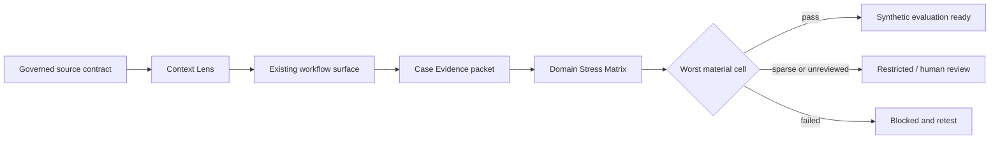

# SCRIMED P31 Applied Intelligence

SCRIMED P31 adds shared clinical evidence controls to existing workflow surfaces. The implementation is synthetic/no-PHI and does not authorize clinical care, payer action, EHR mutation, production connectors, certification claims, or customer go-live.

## Implemented P0 Controls

### Context Lens

The Clinical Context Gateway now exposes a Context Lens contract with two isolated modes:

- `public-evidence`: public sources only, no PHI, no patient-specific action.
- `clinical-context`: authenticated, tenant-scoped, minimum-necessary, consent-aware, human-reviewed metadata or synthetic-deidentified context only.

Every proposed next action includes source provenance, freshness, missing-data state, confidence, calibration status, constraints, and an action reason. Missing, stale, expired, unverified, or low-confidence evidence triggers abstention or review. Live PHI remains disabled.

### Evidence From First Case

The Documentation-Before-Authorization workbench now emits a deterministic Case Evidence packet for every accepted synthetic run. The packet includes:

- hashed case identity;
- cohort and eligibility definition;
- baseline/comparator description;
- intervention timestamps;
- source lineage;
- model, prompt, tool, and policy versions;
- reviewer action and override state;
- descriptive outcomes;
- safety events;
- missingness and confounders;
- site and subgroup attributes;
- analysis-plan and Trust QA status.

The packet cannot contain a raw case identifier, permits no external distribution, and fixes `causalClaimAllowed` to `false`. Association is not treated as causation.

### Domain Stress Matrix

The Clinical Benchmark Suite now evaluates task x disease/subtype x subgroup x site x modality x language x workflow-state cells. The release decision is controlled by the worst material cell.

Sparse cells are restricted. Failed evidence or metric thresholds block release. High-risk cells without completed human review remain review-gated. A global average cannot override any of these decisions, and synthetic benchmark status never grants clinical authority.

## Architecture



## Current Instrumented Workflow

`/documentation-before-authorization` is the first instrumented workflow. It uses registered synthetic scenarios and enumerated metadata only. Payer submission, medical-necessity determination, external communication, EHR writeback, and reimbursement claims remain blocked.

## Validation

```bash
npm run test:clinical-evidence-controls
npm run smoke:scrimed-p31
npm run smoke:clinical-context-gateway
npm run smoke:scrimed-clinical-benchmark-suite
npm run smoke:documentation-before-authorization
npm run typecheck
npm run lint
npm run test:nonsecret
npm run build
```

## Next Controlled Milestone

Prototype the Imaging Workflow Intelligence Adapter against representative synthetic DICOM/DICOMweb metadata and FHIR R4 `ImagingStudy`, `DiagnosticReport`, `Observation`, and `Provenance` fixtures. The adapter must remain workflow/quality support only and cannot finalize an imaging interpretation.
