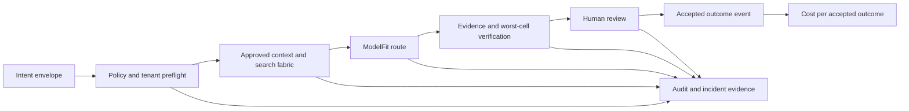

# SCRIMED p.32 Architecture

## Objective

SCRIMED p.32 strengthens the existing Healthcare Intelligence OS around one operating objective: **Cost Per Safe, Clinically Accepted Outcome**. Token volume, model size, alert count, agent activity, and feature count are supporting telemetry, not success criteria.

This implementation is repository-native TypeScript. It extends Clinical Context Gateway, Clinical Evidence Controls, EvalCore benchmark cards, SCRIMED Work model routing, TrustOps, TrialCore boundaries, and release readiness. It introduces no competing runtime, evidence store, router, or policy engine.



## Shared Contracts

`app/lib/scrimed-work/p32Contracts.ts` defines the p.32 attribution and evidence vocabulary while reusing the existing `ModelRouteDecision`:

- `PolicyDecision`: `ALLOW`, `REQUIRE_HUMAN`, or `BLOCK`.
- `EvidenceSource`, `EvidenceClaim`, `SearchRequest`, and `SearchResult`.
- `IncidentEvidenceBundle` for restricted incident reconstruction.
- `BenchmarkCard` with origin, population, sampling, rater, contamination, missingness, and external-validity metadata.
- `IntentEnvelope`, `AttentionEvent`, `ConnectorPolicy`, and `TrialCandidateReview`.
- `ICPProfile` and `OutcomeEvent` for nonclinical commercial intelligence and value measurement.
- `ApprovalEvidence` and `ReleaseGateResult` bound to exact fingerprints.

Consequential attribution includes tenant, authenticated actor or agent, purpose, workflow, input classification, model/provider/version, evidence, policy, decision, approval state, timestamp, correlation ID, and idempotency key.

## Governed Agent Runtime

`app/lib/scrimed-work/governedRuntime.ts` extends the existing SCRIMED Work tool registry with candidate-bound authorization rather than introducing a second orchestrator. A `CapabilityManifest` limits actor, tenant, purpose, tools, resources, data classes, risk, rate, tokens, time, spend, and tool calls. An `ExecutionGrant` binds issuer, audience, subject, exact action scope, candidate/source fingerprints, environment, nonce, expiry, and approval references.

Authorization stages are separate: `read`, `propose`, `approve`, `execute`, and `verify`. Execution requires a current integrity-checked grant, exact scope, idempotency key, complete approval references, and one-time nonce consumption. Replays, stale or cross-environment grants, candidate drift, tenant drift, self-elevated tools, budget excess, and current-policy hard blocks fail closed. Receipts contain digests and redacted metadata only. Live PHI, diagnosis, treatment, prescribing, payer submission, EHR writeback, production mutation, deployment, and external distribution remain hard blocked by current policy.

## Production Harness

`app/lib/scrimedP32ProductionHarness.ts` makes cost per verified successful task the economic denominator while preserving noncompensable safety, privacy, security, provenance, and required-evidence gates. A fast or inexpensive candidate cannot compensate for a failed mandatory gate. Candidates must also pass task-specific floors for quality, latency, reliability, evidence coverage, correction rate, throughput, composability, and accepted-task cost.

Promotion uses Pareto fitness among candidates that already passed every mandatory floor. LLM judges remain secondary signals; deterministic validation, domain rubrics, counterfactual checks, and blinded human review govern high-risk eligibility. Retry loops are bounded at five attempts and expose exhaustion. Production failures, monitor findings, and user corrections enter an offline corpus only after de-identification and reviewer approval.

Every reviewed execution can produce a ModelBOM containing exact model/provider/version, configuration hash, policy, prompt/template, retrieval sources, tool versions, serialization strategy, runtime configuration, and correlation ID. Operational events are tamper-evident and sensitive fields are redacted before hashing.

## Care Context and Autonomy

`app/lib/scrimedP32CarePolicy.ts` evaluates `ambulatory_self_service`, `ambulatory_clinician`, `acute_clinician`, and `acute_critical` against low, moderate, high, and prohibited task risk. Capability ceilings are static; a task cannot grant itself new tools or actions.

- Ambulatory self-service is limited to bounded education, scheduling preparation, reminders, and navigation.
- Ambulatory clinician support may prepare documentation, context, evidence, and alerts for human review.
- Acute support is read-only and advisory, requires authenticated clinician identity, current context, evidence, strict freshness, and confirmation.
- Acute-critical requests fail closed without action-scoped signed human authorization and still grant no autonomous execution authority.
- Diagnosis, prescribing, medical orders, disposition, payer submission, and EHR writeback remain prohibited.

Identity uncertainty, contradictions, red flags, worsening symptoms, missing evidence, and stale context route to a responsible human role with stable reason codes.

## Memory-Aware Resource Admission

`app/lib/scrimedP32ResourceAdmission.ts` extends SCRIMED Work and Clinical Assurance capacity controls with simulated device profiles and per-task limits for money, latency, retries, tools, context, resident memory, and KV cache. It evaluates accelerator, precision, bandwidth posture, shared memory, thermal state, power class, privacy zone, model peak memory, cost, latency, context, and zero-copy support before routing.

Runtime states are `NORMAL`, `CONSTRAINED`, `DEGRADED`, and `SAFE_REFUSAL`. OOM, thermal pressure, missing accelerators, timeouts, memory pressure, exhausted retries, or unsupported privacy/residency policy select a measured bounded fallback, require human handoff, or refuse. They never silently change clinical behavior. Current live-PHI authority remains absent, so remote PHI escalation is denied even when a model advertises the capability.

`routeScrimedWorkModel()` accepts an optional resource-admission result. `SAFE_REFUSAL` blocks routing, and only resource-approved model identifiers remain eligible. Existing calls without resource metadata retain their prior `NORMAL` synthetic route behavior.

## Longitudinal Clinical Data Views

`app/lib/scrimedP32ClinicalDataViews.ts` extends the Clinical Data Fabric rather than replacing it. Canonical facts retain tenant, synthetic subject, terminology, source-system identifier, source digest, source time, transformation version, confidence, severity, duration, temporal course, control status, uncertainty, measurements, and provenance.

The original structured source remains authoritative. Raw structured, compact structured, and clinical narrative serializations are derived model-input views and are benchmarked for source-link coverage, temporal coverage, measurement preservation, estimated token use, latency class, and cost class. Data quality scores completeness, freshness, contradictions, units, duplicates, and patient matching. Cross-tenant access fails closed, and action-oriented measure bindings require source facts and an accountable workflow owner while external submission remains disabled.

The complexity sentinel classifies material fact volume, measurements, uncertainty, severity, and temporal change. High-risk complex context permits only a validated complete strategy; if no validated strategy fits the context budget, the result is `SAFE_REFUSAL`. Truncation is never authorized.

## Multimodal Normalization and Artifact Ledger

`app/lib/scrimedP32MultimodalNormalization.ts` provides synthetic/deidentified contracts for PDF, scan, handwriting, FHIR, HL7 v2, X12, CSV, SFTP manifest, claim, imaging-metadata, and genomics-metadata facts. Each candidate fact retains document digest, extraction method/version, page/span/geometry/path, confidence, terminology, units, observation time, transformation history, correction history, and conflicts. Low-confidence or conflicting facts require human review and never become verified clinical truth automatically.

`app/lib/scrimedP32ArtifactLedger.ts` creates location-independent document IDs, SHA-256 content identity, immutable parent revisions, tamper-evident chaining, tenant isolation, recoverable trash/restore revisions, and backup hash verification. The ledger grants no distribution, deployment, clinical, payer, or EHR authority.

## Guarded Payer Voice and RCM

`app/lib/scrimedP32RcmVoice.ts` is disabled by default through `SCRIMED_P32_RCM_VOICE_ENABLED`. When explicitly enabled for local synthetic evaluation, it permits only eligibility/benefit status, prior-authorization status, claim status, and credentialing status. The deterministic state machine checks actor authorization, payer route, identity factors, approved script, recording/consent configuration, retries, confidence, ambiguity, and contradiction.

Only transcript and structured-outcome hashes leave the evaluator; raw audio is never stored. Ambiguous, contradictory, low-confidence, or exhausted results enter a human exception queue and cannot create a proposed writeback. A clear result may create an idempotent proposed-writeback record, but writeback execution, payer submission, appeals, medical-necessity statements, coding changes, collections, and negotiation remain blocked.

## Application Rationalization and Vendor Sentinel

`app/lib/scrimedP32ApplicationRationalization.ts` evaluates applications using workflow ownership, observed use, telemetry coverage, interfaces, dependencies, annual cost, cyber risk, clinical criticality, evidence of value, and portability. Retirement cannot advance to human approval until export, retention, hash verification, replacement validation, rollback, downtime, recovery, legal, security, clinical-owner, and workflow-owner evidence pass. Code never performs retirement.

Acquisitions, API restrictions, terms, BAA, subprocessor, residency, pricing, service, and roadmap changes become typed vendor events. Unresolved material changes freeze new deployment and writes and require legal, security, portability, privacy, clinical, and/or finance review. Vendor and social-media claims remain unverified hypotheses until SCRIMED reproduces them.

## Clinical Search Fabric

The Clinical Context Gateway now exposes a deterministic Clinical Search Fabric contract:

1. Classify intent.
2. Bound query expansion.
3. Apply source type, jurisdiction, tenant, and content-rights policy.
4. Rank by lexical relevance, authority, and freshness.
5. Validate material claims against cited passages.
6. Present conflicts and uncertainty.
7. Distinguish retrieval failure from no matching evidence.
8. Record total cost and cost per accepted answer.

No crawler or external retrieval provider is enabled. Authenticated, prohibited, or unlicensed content is rejected by policy. Only approved nonpatient public reference material may be cached; patient-specific caching remains disabled.

## Trust Release Guardian

TrustOps now references a PHI-safe incident-forensics contract. A bundle retains hashes and identifiers for the model configuration, generated/displayed output, evidence, tools, service state, workflow stage, user actions, approvals, remediation, and counterfactual comparisons. Bundles are hash chained and cannot cross tenant or incident boundaries.

The incident system can reconstruct an ordered timeline and classify data/input, model, retrieval, integration, interface, configuration, policy, and exceptional-case failures. It cannot determine malpractice, causation, breach notification, or legal liability.

### Incident Operator Checklist

- Restrict access to named incident reviewers.
- Preserve legal-hold state before modifying retention.
- Verify the bundle hash before analysis.
- Compare corrected input, prior model, alternate model, and no-AI workflow when evidence exists.
- Record contributing factors without assigning liability.
- Bind rollback, threshold, data, UX, disclosure, and revalidation actions to evidence references.

## EvidenceOps and Benchmark Provenance

EvalCore benchmark cards now carry origin-platform, source-population, specialty, time-range, task-distribution, sampling, inclusion/exclusion, deidentification, contamination, model-access, rater, blinding, adjudication, reliability, refusal, missing-data, confidence-interval, funding/conflict, holdout, and external-validity metadata.

Task lanes include education, evidence synthesis, differential support, next-step reasoning, treatment-planning support, documentation/CDI, operational workflow, and research support. Treatment and differential lanes remain decision-support evaluation only.

Promotion requires workflow-specific safety, correctness, citation, abstention, latency, accepted-answer cost, and human-acceptance thresholds. A strong aggregate result cannot override a failed, sparse, unreviewed, or safety-critical worst cell. No benchmark can authorize a universal model-winner claim or clinical authority.

## Model Routing Policy

The existing SCRIMED Work router now accepts provider health, provider blocks, workflow acceptance measurements, and a minimum human-acceptance threshold. An unavailable primary can route only to an independently policy-compliant provider. Missing eligibility returns an explicit abstention; silent fallback and privacy downgrade remain prohibited.

Bedrock-compatible `fast-economical`, `balanced`, and `flagship` aliases are configured only through:

- `SCRIMED_BEDROCK_LUNA_MODEL_ID`
- `SCRIMED_BEDROCK_TERRA_MODEL_ID`
- `SCRIMED_BEDROCK_SOL_MODEL_ID`

An alias is not an approval. Every configured model remains shadow-evaluation-only until provider scope, BAA/DPA where applicable, region, residency, retention, logging, subprocessor, workflow performance, worst-cell, accepted-answer cost, human review, and rollback evidence are approved.

## Intent, Trial, Attention, and Connectors

- Intent compilation normalizes plain text and streamed content-block arrays, separates verified facts from proposed inferences, exposes contradictions and missing information, and blocks protected/hidden-state inference.
- Ambiguous clinical intent requires clinician review. Diagnosis, treatment, trial enrollment, payer submission, EHR writeback, and patient messaging requests are blocked.
- TrialCore accepts synthetic subjects only. Eligibility is preliminary, consent and coordinator gates remain pending, randomization is external-authorized-only, and enrollment/randomization are always false.
- Attention events use `BACKGROUND`, `INBOX`, `INTERRUPTIVE`, and `HARD_STOP`. Nonbackground events require evidence and an actionable recommendation. Hard stops require human review and cannot be silently suppressed.
- Connector policy enforces official API, delegated identity, scoped capabilities, read/write separation, terms versions, rate limits, and action-scoped approval. A material terms change freezes new automation and writes.
- SCRIMED's agent-ready connector contract requires scoped OAuth or service identity, agent identity, granular capabilities, audit receipts, rate limits, consent, revocation, and portable export.

## GrowthOS

GrowthOS compiles approved public organizational sales material into a draft ICP. It excludes patient data, personal data, protected-attribute inference, sensitive profiling, prohibited scraping, deceptive personalization, automatic mass outreach, and unapproved sending. Human approval is required before manual prospecting, and opt-out state is mandatory.

## Release Gates

The p.32 gate registry tracks automated and external evidence for:

- clean reviewed source commit;
- exact source/artifact provenance;
- named reviewer approval;
- founder, counsel/claims, and finance investor-deck approval;
- validation-evidence integrity;
- AAL2 CLI evidence;
- migration dry-run and database-owner approval;
- intended-use, legal, clinical, security, and privacy signoff;
- deployment authorization;
- post-deployment smoke;
- customer go-live authorization.

Approval evidence must match the exact full source commit, source-tree fingerprint, artifact fingerprint, and validation-evidence fingerprint and must be unexpired. Approval records also require hashed actor and tenant scope, declared identity assurance, a bounded validity window, metadata-only evidence pointer, and a deterministic decision-integrity hash. Automated evidence has the same exact-candidate binding and its own integrity hash. A dirty worktree blocks immutable provenance. Individual gate `PASS` does not grant aggregate release authority.

The protected candidate-review control plane at `/pilot-workspace/access` keeps source review separate from the existing claims/distribution sign-off workflow. A tenant admin or pilot lead may assign the configured exact candidate only to a distinct active `reviewer` member. That reviewer must use a fresh AAL2 session and may record one immutable approval or rejection. The signed transfer artifact is scoped only to `named-reviewer-approval`, remains short-lived, and always carries `releaseAuthorityGranted: false`. Configuration, database migration, trusted-key registration, and a controlled infrastructure rollout are required before the feature can be enabled; the bootstrap rollout cannot self-approve its own source.

Gate states are `PASS`, `FAIL`, `BLOCKED`, `OPERATOR_REQUIRED`, or `NOT_APPLICABLE`. Evidence that exists but is rejected, expired, malformed, or integrity-invalid is `FAIL`; absent implementation or prerequisites are `BLOCKED`; irreducible named action is `OPERATOR_REQUIRED`. Every unresolved gate includes the responsible role, exact action, exact fingerprints, command or form, evidence window, rejection consequence, and verification procedure.

`app/lib/scrimedP32GateEvidence.ts` reconciles the local candidate manifest, bounded validation report, investor-artifact review, optional protected AAL2/deployment evidence, and qualified external decisions into one no-secret packet. It rejects duplicate identifiers, fingerprint drift, malformed hashes, future or expired records, and tampered decisions. Gates are grouped into candidate-review, pre-deployment, post-deployment, and customer-go-live phases so unresolved authority remains explicit.

`npm run release:scrimed-p32-evidence:strict` verifies that a candidate review packet can be produced. `npm run release:scrimed-p32-evidence:all-gates` intentionally remains nonzero until every defined evidence gate is satisfied. Neither command grants commit, deployment, migration, external-distribution, legal, clinical, privacy, certification, or customer authority.

## Clinical Safety Boundary Matrix

| Capability | Current state | Required before expansion |
| --- | --- | --- |
| Public/synthetic evidence review | Local deterministic foundation | Source adapters, rights review, clinician acceptance evaluation |
| Deidentified clinical-context review | Human-review only | Tenant authorization, governance, validation, privacy/security review |
| Live PHI | Blocked | BAA/DPA scope, risk analysis, enclave/provider authorization, customer approval |
| Diagnosis/treatment/prescribing | Blocked | Separate intended-use, regulatory, clinical evidence, human-factors, legal authorization |
| Trial enrollment/randomization | Blocked | Protocol, IRB/site, consent, coordinator, approved external randomization integration |
| Patient outreach | Blocked | Consent, content review, channel authorization, rollback and monitoring |
| Payer submission | Blocked | Contract, connector, payer, legal, operational and human approval |
| EHR writeback | Blocked | Connector certification decision, customer approval, safety validation, rollback |
| Certification or customer go-live claims | Blocked | Exact issued evidence and named authority approval |

## Rollback

- Model routes: open the provider circuit, activate the global/workflow kill switch, preserve the route decision, and hand off safely. Never downgrade privacy or evidence checks.
- Resource admission: stop new work, preserve the last admission hash, clear only approved caches, reduce bounded concurrency, and return to the last validated model/profile. Do not bypass memory or privacy limits.
- Payer voice: disable `SCRIMED_P32_RCM_VOICE_ENABLED`, abandon synthetic sessions, preserve hashes and reason codes, and route unresolved work to a human queue. No live call or writeback state exists.
- Application/vendor: freeze writes and new deployments, preserve export and contract evidence, activate the approved portability route only after review, and retain the prior system until recovery and rollback are tested.
- Search: invalidate only approved public-reference cache entries, preserve retrieval and claim-validation evidence, and return abstention or review.
- Connector: freeze writes, revoke the scoped credential, preserve audit receipts, and return reviewable read-only status.
- TrialCore: stop at preliminary review; no enrollment or randomization state exists locally.
- Incident response: append a rollback remediation event to the verified evidence chain.
- Release: reject stale approvals and return to the last clean reviewed immutable candidate.

## Synthetic Local Development

All p.32 policy tests use deterministic synthetic or public-reference fixtures and no network calls.

```bash
npm run test:scrimed-p32
npm run test:scrimed-p32-execution-harness
npm run test:scrimed-p32-release-hardening
npm run smoke:scrimed-p32
npm run test:scrimed-p32-release-evidence
npm run security:secret-scan
npm run security:sbom
npm run release:migration-packet
npm run release:scrimed-p32-evidence:strict
npm run typecheck
npm run lint
npm run test:nonsecret
npm run build
git diff --check
```

Feature flags:

- `SCRIMED_P32_CONTROL_PLANE_ENABLED=false` by default unless explicitly enabled.
- `SCRIMED_TRIALCORE_ENABLEMENT_ENABLED=false` by default; enabling retains synthetic-only and no-enrollment boundaries.
- `SCRIMED_GROWTH_OS_ENABLED=false` by default; enabling retains no-send and public-material-only boundaries.
- `SCRIMED_P32_RCM_VOICE_ENABLED=false` by default; enabling permits synthetic state-machine evaluation only and never enables a live call or writeback.
- `SCRIMED_P32_EVIDENCE_ISSUER_ENABLED=false` by default. Enabling requires a server-only Ed25519 key, exact candidate fingerprints, an applied protected issuance-ledger migration, current retained no-PHI QA evidence, AAL2, and a database-authorized tenant-admin or pilot-lead. It signs only short-lived AAL2 technical evidence and grants no human or release authority.
- Provider calls, connector writes, trial enrollment, automatic outreach, live PHI, payer submission, and EHR writeback remain disabled.

## External References

The supplied external materials are architectural research inputs, not proof that SCRIMED implements, licenses, validates, or is approved by those systems:

- ROX web-search synthesis architecture: `https://www.rox.com/articles/websearch-synthesis-optimization`
- Incident analysis research: `https://www.sciencedirect.com/science/article/pii/S1344622325001981`
- Benchmark provenance research: `https://www.nature.com/articles/s41591-026-04431-5` and `https://arxiv.org/abs/2606.28960`
- Model-provider configuration reference: `https://aws.amazon.com/blogs/machine-learning/openai-gpt-5-6-sol-terra-and-luna-are-now-generally-available-on-amazon-bedrock/`
- Trial pattern reference: `https://clinicaltrials.gov/study/NCT07260916`
- Connector terms references: `https://www.servicetitan.com/legal/terms-of-use` and `https://www.servicetitan.com/legal/api-terms`

## Known Limitations

- No external search, commercial model, connector, EHR, payer, trial, or outreach call is enabled.
- A durable p.32 AAL2 evidence-issuance migration is present but not applied by this work. The broader incident and release-gate registries remain typed deterministic contracts until separately approved persistence work is completed.
- Device, memory, thermal, power, energy, and zero-copy results are deterministic simulations until approved runtime telemetry is integrated; energy remains unavailable rather than fabricated.
- Payer voice has no telephony, IVR, recording, payer, credential, or writeback adapter. Only the guarded synthetic state machine is implemented.
- Application disposition has no contract termination, data migration, or retirement executor. Recommendations require named human review.
- Benchmark fixtures are synthetic and cannot establish clinical validity or external generalizability.
- Current worktree provenance remains blocked until all intended changes are reviewed and committed by an authorized operator.
- External legal, clinical, privacy, security, regulatory, deployment, and customer approvals remain outside automated code authority.
- Remote branch protection, private vulnerability reporting, secret scanning, push protection, required reviews, force-push protection, and required status checks are not verified or changed by local code.
