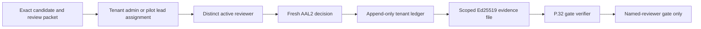

# SCRIMED P.32 Candidate Review

## Purpose

The candidate-review control plane records a distinct human source-review decision against one exact SCRIMED p.32 candidate. It closes the infrastructure gap between a generated review packet and machine-verifiable `ApprovalEvidence` without repurposing the claims/distribution sign-off workflow.

This feature is metadata-only. It does not authorize deployment, migration, release promotion, external distribution, live PHI, clinical action, payer submission, EHR writeback, certification claims, or customer go-live.

## Control Flow



The assignment and decision stages use separate database functions and roles. The database recomputes hashed identities from `auth.uid()`, verifies tenant membership, rejects self-assignment, rejects expired or reused assignments, and stores an append-only hash chain. A one-use UUID idempotency key is mandatory for each mutation.

Every browser mutation must have an exact same-origin request provenance. Cross-origin, malformed, navigational, and browser-like requests without an Origin header fail closed. A non-browser operator client must declare the fixed, nonsecret `operator-smoke-v1` request context and still pass bearer authentication, AAL2, role, tenant, idempotency, candidate, and durable-ledger checks.

The exported `ApprovalEvidence` includes the exact review-packet SHA-256 inside the signed evidence payload. The release verifier independently regenerates that packet fingerprint and rejects an otherwise valid reviewer signature when it references a different packet. This prevents a decision from being replayed after the candidate review scope changes.

## Roles

- `tenant-admin` or `pilot-lead`: assign the exact candidate to a reviewer identity hash.
- `reviewer`: record one approval or rejection for the assigned candidate.
- `observer`: inspect exact candidate fingerprints without assignment or decision controls.
- `principal-engineer`: the professional review role encoded in the p.32 approval evidence. Workspace membership alone does not create broader release authority.

The assigning identity and reviewing identity must differ. Approval does not grant release authority; downstream deployment, migration, legal, clinical, security/privacy, and customer gates remain independent.

The protected summary reads only the authenticated actor's tenant membership row through existing row-level security and returns a typed capability view. The browser renders only the actor's permitted stage, while the API repeats the role check before signing work and the database remains the final authorization boundary. Missing, inactive, malformed, or unverifiable membership fails closed.

## Configuration

The feature defaults off with `SCRIMED_P32_CANDIDATE_REVIEW_ENABLED=false`. A protected environment must supply:

- issuer ID and key ID;
- an Ed25519 private key through the approved server-side secret manager;
- exact source commit;
- exact source-tree, artifact, validation-evidence, and review-packet SHA-256 fingerprints.

The matching public key belongs in `SCRIMED_P32_EVIDENCE_TRUSTED_PUBLIC_KEYS_JSON` with:

- `allowedAutomatedEvidenceIds: []`;
- `allowedApprovalGateIds: ["named-reviewer-approval"]`;
- `allowedIdentityAssurance: ["aal2-protected-workspace"]`;
- a bounded validity window and active, nonrevoked status.

The runtime verifies this narrow trust scope, key match, and validity window before it reports readiness, creates an assignment, or signs a decision. An absent, overbroad, expired, revoked, or mismatched trust entry fails closed.

Never store the private key in Git, `.env.example`, browser variables, review packets, logs, screenshots, or chat. Exact candidate settings must change after any source, artifact, validation, or review-packet mutation.

## Operator Workflow

1. Produce and independently inspect the exact local candidate validation and review packet.
2. Apply `20260722120000_p32_candidate_review_control_plane.sql` only through the separately approved migration process.
3. Provision a scope-limited signing key and trusted public-key entry through the approved secret/configuration channels.
4. Deploy the control-plane infrastructure only after the bootstrap candidate receives the existing manual source, security, privacy, migration, and deployment approvals. The new control cannot approve its own bootstrap release.
5. Enable the feature for the exact target candidate.
6. The reviewer opens `/pilot-workspace/access`, verifies AAL2, and copies the displayed identity hash.
7. A tenant admin or pilot lead enters that hash and records the assignment.
8. The administrator uses **Copy Assignment ID** and transfers only that UUID through the approved reviewer channel.
9. The reviewer enters the assignment ID, reviews the exact packet, and records approval or rejection.
10. The reviewer downloads the short-lived signed evidence JSON through the workspace panel.
11. A release steward supplies that file to `npm run release:scrimed-p32-evidence:strict -- --evidence-file=/absolute/path/file.json` while its outer attestation is current.
12. Remove the transfer file according to the evidence retention policy after the verified gate packet is archived.

The evidence file contains hashes and a public signature, not a bearer token, raw identity, secret, PHI, or source content. It must still use the approved access-controlled evidence channel.

## Failure Behavior

- Missing feature flag, candidate settings, key, ledger, or AAL2 session: fail closed.
- Wrong workspace role, wrong workflow stage, or inactive reviewer membership: forbidden before signing or persistence.
- Same assigning and reviewing identity: forbidden.
- Candidate, signed review-packet fingerprint, assignment, or tenant mismatch: rejected.
- Expired assignment, duplicate decision, or replayed idempotency key: rejected.
- Unsupported fields, free-text rationale, token-like content, or PHI-like identifiers: rejected.
- Rejection evidence never satisfies an approval gate.

## Verification

```text
npm run test:scrimed-p32-candidate-review
npm run contract:scrimed-p32-candidate-review
npm run typecheck
npm run lint
npm run test:nonsecret
npm run build
git diff --check
```

Local tests use generated Ed25519 keys and synthetic identifiers only. They do not apply the migration, call production, create an approval, or enable any consequential action.
