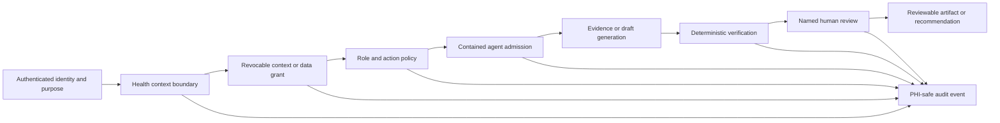

# SCRIMED p.32 Clinical Operations and Agent Boundaries

## Status

This repository-native TypeScript slice extends the existing SCRIMED p.32 control plane. It is deterministic, synthetic-data-only, metadata-first, and non-authoritative. It adds no external calls, production connector activation, live PHI path, clinical writeback, payer submission, diagnosis, treatment, prescribing, enrollment, or customer go-live authority.



## Health Context and Role Authority

`app/lib/scrimedP32HealthConversationFabric.ts` separates patient and clinician identities, memory scopes, tools, action classes, and product roles.

- MyVitals AI and CareExplain are the patient-facing toolbelt.
- Sanar AI and Perfect Chart are the clinician-facing toolbelt.
- Health context is isolated from unrelated conversations by tenant, subject, purpose, and boundary.
- A non-health context requires an explicit, purpose-bound, revocable `ContextGrant`.
- A patient agent cannot call clinician tools or diagnosis, prescribing, ordering, EHR mutation, or payer actions.
- A clinician agent may prepare evidence-grounded drafts, but a distinct named clinician must approve a `SharedEncounterBrief`.
- Minimum-necessary EHR scopes are checked independently from authentication.
- Every handoff receives the approved brief and active grant objects, derives their identifiers, and verifies tenant, subject, purpose, state, lifetime, and brief fingerprint.
- Every handoff records hashes and references only; raw conversations and raw PHI are excluded from audit events.

Authentication or connector access does not imply clinical authority.

## Contained Agent Execution

`app/lib/scrimed-work/agentExecution.ts` adds an experimental contained execution adapter behind a disabled feature flag.

- Environments are ephemeral and tenant isolated.
- Network egress is default deny and requires exact destination and purpose.
- Workload identities and capability leases are short lived and task bound.
- Admission binds the request classification to the environment classification and rejects PHI-blocked or unknown data.
- Forks receive a new identity and fresh credentials; tenant, identity, lease, active-state, lifetime, and privilege-subset lineage must all validate.
- Snapshots are encrypted, digest-only, synthetic-only, and have strict expiry.
- No ambient credentials, secrets, tokens, raw PHI, or hidden chain-of-thought enter snapshots or traces.
- CPU, memory, wall-clock, token, tool-call, and spend limits are checked before admission.
- One OpenTelemetry-compatible causal trace links intent, model, retrieval, tool, approval, mutation proposal, outcome, retry, latency, and cost metadata.
- Emergency revocation denies new work and invalidates active capability leases.

The local adapter models identity and integrity controls. Production mTLS, a workload identity issuer, encrypted durable storage, and a real sandbox runtime remain external infrastructure requirements.

## Ambient and Patient-Controlled Records

`app/lib/scrimedP32PatientRecords.ts` separates audio consent, retention, ambient drafts, longitudinal source manifests, and patient data grants.

- Draft creation and clinician signoff require the active, tenant- and encounter-bound audio consent object; withdrawal blocks future signing.
- Raw audio is not retained by default; any lawful retention policy has an explicit deletion deadline and verified deletion event.
- Original drafts, clinician edits, rejection reasons, reviewer identities, and timestamps remain attributable.
- Clinician signoff is mandatory before record inclusion.
- Patient grants are granular, purpose-bound, expiring, exportable, and revocable.
- Revocation immediately prevents future connector access and produces a `RevocationReceipt`.
- Source values remain alongside normalized representations with provenance and source coverage.
- Training and secondary use remain prohibited without separately approved governance.

Ambient output cannot create orders, diagnoses, billing changes, payer submissions, or EHR writeback.

## TrialCore Failure Intelligence

`app/lib/scrimedP32ResearchIntelligence.ts` adds source-first trial failure investigation contracts. Evidence is always one of `FACT`, `INFERENCE`, `HYPOTHESIS`, `CONTRADICTION`, or `UNKNOWN`.

- Official registry records are modeled as the preferred source.
- External ClinicalTrials.gov and PubMed adapters are read-only interfaces and remain disabled.
- Status, eligibility, endpoint, enrollment, and completion-date history retains source version and retrieval time.
- Contradictory and missing evidence remain visible.
- Multiple alternative explanations are required for decision-grade review.
- Producer components and identity hashes remain attached to the investigation.
- An adversarial judge or producer cannot approve its own conclusion, including through a renamed component.
- A named independent AAL2 human review context is required before a final review disposition.
- Hypotheses never render as established facts.

Trial enrollment, local randomization, treatment selection, and clinical authority remain prohibited.

## Biological Retrieval

The same research module provides a pluggable `BiologicalEmbeddingProvider` and a deterministic test provider.

- Only public or properly governed deidentified research data is eligible.
- Dataset, assay, organism, tissue, disease, laboratory, preprocessing, normalization, batch correction, demographics, and accession metadata remain attached.
- Biological similarity is distinct from textual similarity.
- Study-level holdouts prevent sample leakage from the same study.
- Study identifiers are case- and whitespace-normalized before overlap evaluation.
- Candidate, feature, and result budgets bound deterministic similarity work before embedding.
- Cross-laboratory and cross-platform evaluation, negative controls, known positives, and uncertainty are mandatory.
- Every relationship is labeled as a research hypothesis.

Biological similarity cannot trigger diagnosis, treatment, patient matching, or clinical action. Research tool exposure is read-only and disabled in clinical production.

## Imaging and MRD

`app/lib/imagingWorkflowIntelligence.ts` extends the existing synthetic DICOM/FHIR adapter with vendor-neutral model admission, DICOM contracts, site validation, recommendation-only queue policy, maximum-delay protection, drift evidence, radiologist overrides, and an outcome ledger.

`app/lib/scrimedP32OncologyIntelligence.ts` extends oncology evidence support with MRD assay, specimen, observation, comparability, coverage, and clinician-review contracts.

- Imaging models must pass offline, shadow, DICOM contract, and site validation before they can produce a queue recommendation.
- Queue recommendations never mutate a live queue and radiologists retain full override authority.
- Lower-ranked studies retain a maximum-delay safeguard.
- MRD values preserve assay-specific units and provenance.
- Observations from incompatible assays cannot be merged into a trend.
- A comparability record does not itself normalize values; mixed-assay normalization remains false until a separately validated transform exists.
- MRD output is clinician-reviewed evidence and coverage preparation only.

Diagnostic finalization, treatment selection, test ordering, payer submission, and EHR writeback remain prohibited.

## Provider Conformance

`app/lib/scrimed-work/providerRegistry.ts` and `modelRouter.ts` now accept provider capability, exact artifact, conformance, task-evaluation, promotion, and rollback evidence.

- Routing remains provider neutral.
- Exact model or weight, tokenizer, quantization, runtime, serialization, and tool-contract fingerprints are required.
- JSON, function-call, streaming, retry, timeout, rate-limit, context, vision, and failure semantics are conformance dimensions.
- Residency, retention, zero-data-retention, and BAA states remain unverified until documentary evidence exists.
- Public leaderboard metadata cannot promote a model.
- External/provider-backed candidates require a passing conformance run. Only signed synthetic no-call adapters may use the registry-only local path.
- Non-finite, negative, or out-of-range measured evaluation values block promotion.
- Fallback cannot weaken the safety tier or occur silently.
- Kimi and Nemotron examples are disabled evaluation profiles only.

Promotion requires task-specific regression evidence, canarying, named approval, and a tested rollback receipt.

## Network and Prior Authorization

`app/lib/scrimedP32NetworkIntelligence.ts` models facilities as independently measurable nodes and preserves site and subgroup variance.

- Utilization, access, burden, denials, reimbursement, adoption, safety, outcomes, and cost remain attributable to site and cohort.
- Enterprise averages cannot hide a material local variance.
- Administrative burden analysis compares review time and cost with configured expected reimbursement.
- Prior-authorization proportionality analysis tests whether cited criteria address the service under review.
- Tenant and source identifiers are derived from the attributable burden case and proportionality analysis rather than accepted independently.
- Policy evidence packets distinguish observed facts, analyst inference, and unresolved questions.

The module provides policy research and human-reviewable preparation only. It cannot determine coverage, submit an authorization or appeal, or mutate payer and RCM systems.

## Feature Flags

Safe contract evaluation is available locally. Higher-risk or externally dependent behavior defaults off:

- `SCRIMED_HEALTH_CONVERSATION_FABRIC_ENABLED=true`
- `SCRIMED_CONTAINED_AGENT_EXECUTION_ENABLED=false`
- `SCRIMED_AMBIENT_DOCUMENTATION_ENABLED=false`
- `SCRIMED_PATIENT_CONTROLLED_RECORDS_ENABLED=false`
- `SCRIMED_TRIAL_FAILURE_INTELLIGENCE_ENABLED=false`
- `SCRIMED_BIOLOGICAL_SIGNATURE_RETRIEVAL_ENABLED=false`
- `SCRIMED_IMAGING_QUEUE_RECOMMENDATIONS_ENABLED=false`
- `SCRIMED_MRD_INTELLIGENCE_ENABLED=false`
- `SCRIMED_PROVIDER_CONFORMANCE_ENABLED=true`
- `SCRIMED_NETWORK_INTELLIGENCE_ENABLED=false`

Setting a flag only exposes the local synthetic contract. It does not grant production, clinical, connector, payer, EHR, legal, migration, or deployment authority.

## Threat and Trust Boundaries

The focused policy suite covers cross-context disclosure, stale grants, role escalation, overbroad EHR scopes, direct/DNS/proxy egress, environment-classification mismatch, snapshot leakage, parent-token reuse, cross-tenant fork lineage, expired leases, patient-identifier trace redaction, consent withdrawal, missing clinician signoff, retention deletion, evidence misclassification, hidden contradictions, producer/reviewer aliasing, normalized study leakage, research workload budgets, research-to-clinical crossing, unvalidated imaging queue effects, maximum-delay protections, assay incompatibility, false normalization, non-finite promotion metrics, leaderboard promotion, provider conformance failure, hidden site variance, payer mutation, and incomplete causal traces.

Retrieved content is untrusted data and cannot grant tools, credentials, network access, or policy changes. An agent cannot approve its own escalation, release, clinical output, or production policy.

## No database migration

No database migration is included. This increment adds typed contracts, deterministic pure policy services, synthetic fixtures, summaries, documentation, and tests. Durable storage for grants, consent, traces, clinical drafts, snapshots, evidence, and outcomes requires a separately reviewed data model, retention analysis, tenant-isolation proof, disposable-database dry run, migration approval, and rollback evidence.

## Rollback

1. Disable the affected feature flag.
2. Revoke active context grants, patient grants, workload identities, and capability leases.
3. Activate the global or workflow emergency stop for contained execution.
4. Remove an unqualified provider from routing without silently substituting another provider.
5. Preserve audit hashes, denial reasons, review decisions, and source references.
6. Restore the last approved provider, policy, prompt, tool, and artifact versions only after compatibility checks.
7. Keep draft, queue, research, MRD, and prior-authorization outputs in human-review state.

Because this slice has no persistence migration and no external activation, rollback is source and feature-flag based. Production rollback still requires a candidate-bound deployment authorization and named owner.

## Validation

```bash
npm run test:scrimed-p32-clinical-operations
npm run contract:scrimed-p32-clinical-operations
npm run smoke:scrimed-p32
npm run typecheck
npm run lint
npm run test:nonsecret
npm run build
node scripts/check-generated-integrity.mjs
git diff --check
```

## Remaining Human and Infrastructure Gates

- Named clinical, privacy, security, and legal review of intended uses.
- Provider documents for BAA, DPA, residency, retention, subprocessors, and zero-data-retention assertions.
- Workload identity, mTLS, sandbox, encrypted snapshot store, durable audit store, and OpenTelemetry deployment design.
- Connector, EHR, PACS/RIS, registry, PubMed, payer, and device approvals.
- Data retention, consent, deletion, and secondary-use approval.
- Database migration design and database-owner authorization.
- Exact-candidate review, deployment authorization, post-deployment evidence, and customer go-live approval.

No local test substitutes for these gates.
