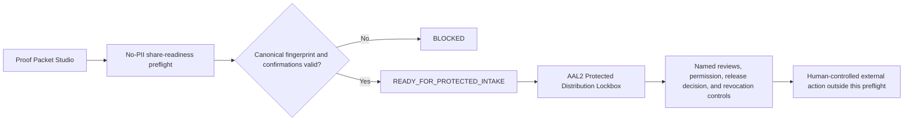

# SCRIMED Proof Packet Studio

SCRIMED Proof Packet Studio is a synthetic/no-PHI packet manifest layer for investor pitch, buyer demo, pilot scope, partner implementation, and internal execution artifacts.

## Why It Matters

SCRIMED has strong proof routes. Proof Packet Studio turns those routes into buyer-ready and investor-ready packages with owner, narrative, deck flow, demo script, proof artifacts, pricing motion, acceptance criteria, limitations, follow-up action, and audit hash.

This improves sales performance, investor confidence, target audience draw, demo quality, pilot handoff, and operational focus without making unsafe clinical, regulatory, customer, or financial claims.

## Packet Types

- investor pitch packet
- buyer demo packet
- pilot scope packet
- partner implementation packet
- internal execution packet
- strategic partner packet
- enterprise buyer packet
- clinical reviewer packet
- security reviewer packet
- legal reviewer packet
- regulatory reviewer packet
- technical diligence packet

## Required Packet Fields

Each packet includes:

- audience
- owner
- objective
- guided path route
- pitch narrative
- deck sections
- demo script
- proof artifacts
- pricing motion
- acceptance criteria
- limitation disclosures
- follow-up action
- readiness status
- retained boundary
- audit hash

## Exact Candidate Binding

Before protected intake, `createScrimedProofPacketCandidateBinding()` can bind a canonical packet
to an exact candidate SHA-256, source fingerprint, evidence fingerprint, recipient class, intended
purpose, evidence inventory, expiration, required approvals, and exact artifact hashes. The
result has its own packet fingerprint and audit hash.

The binding always records `NOT_AUTHORIZED` and `externalDistributionAuthorized: false`. It
proves what would be reviewed; it does not grant permission to share it.

## Downloadable Markdown Packets

Each packet can be rendered as a synthetic/no-PHI Markdown artifact at:

`/api/scrimed-proof-packet-studio/{packetId}/brief`

The endpoint returns Markdown with packet control metadata, objective, pitch narrative, deck sections, demo script, proof artifacts, pricing motion, acceptance criteria, limitation disclosures, follow-up action, required operator review, and retained safety boundary.

Human operator review is required before external sharing. Operators must confirm the packet owner, route list, smoke evidence, freshness expectations, recipient context, and retained boundary.

## Protected Share Readiness

The Proof Packet Studio page now includes a no-PII share-readiness workbench backed by:

`GET|POST /api/scrimed-proof-packet-studio/share-readiness`

The workbench:

- accepts only canonical external-facing packet IDs and exact packet audit hashes;
- uses controlled recipient categories instead of names, email addresses, or free text;
- validates packet-to-purpose, recipient-class, and protected-channel policy;
- requires freshness, limitation, recipient-category, no-sensitive-data, and protected-handoff confirmations;
- maps the result into the existing AAL2 Protected Distribution Lockbox contract;
- lists every externally retained approval still required;
- emits a SHA-256 assessment fingerprint and browser-local Markdown handoff receipt;
- routes post-meeting outcomes into Sales Operations without sending a message or claiming a conversion.

The only successful preflight state is `READY_FOR_PROTECTED_INTAKE`. This means the metadata draft may enter protected review. It never means ready to share, approved for solicitation, released to a recipient, or approved for customer use.

## Canonical Distribution Path

## Safety Boundary

Proof Packet Studio does not authorize live PHI, autonomous clinical care, diagnosis, treatment, medication action, patient outreach, payer submission, EHR writeback, production connector approval, certification claims, investment advice, or customer go-live.

## Next Build Step

Connect approved protected lockbox records to the existing recipient-attestation and access-log reconciliation workflow after the required external review, customer-permission, retention, and release-authority evidence is available. Do not create a parallel share ledger.
