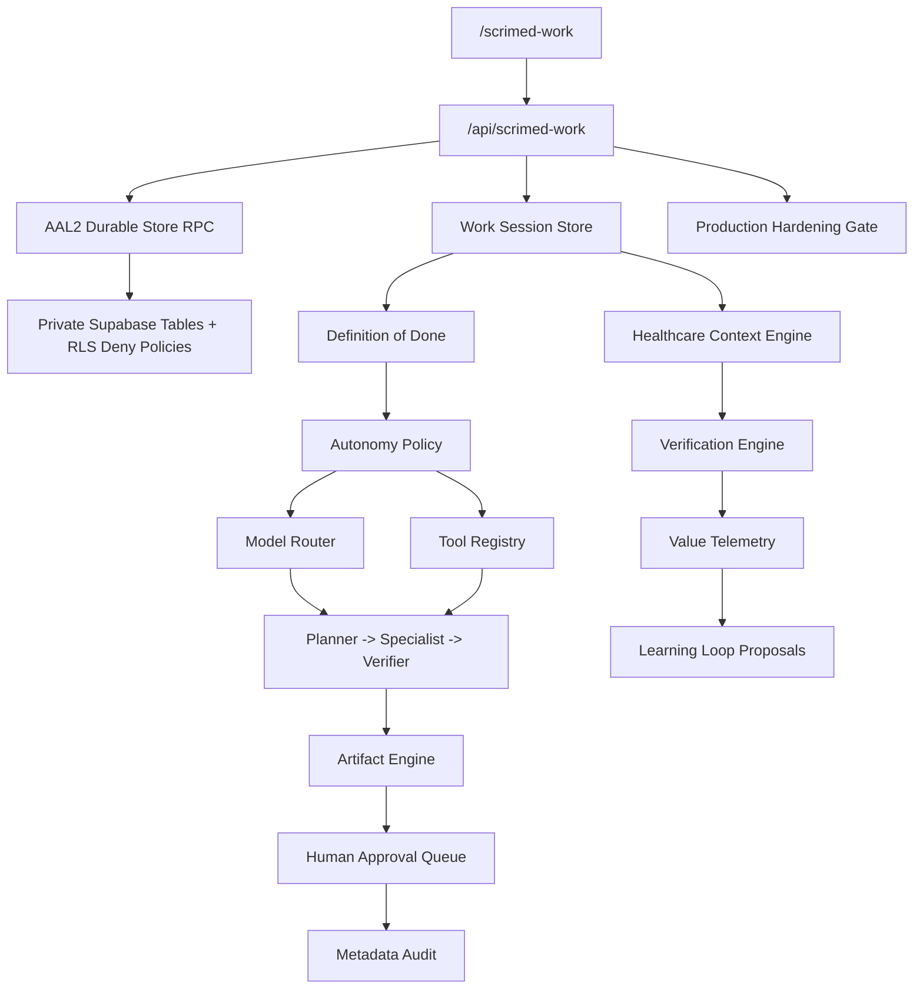

# SCRIMED Work & Intelligence Platform

SCRIMED Work is a synthetic/no-PHI, verification-first control plane for long-running healthcare work sessions. It consolidates workspaces, Definition-of-Done contracts, model and tool routing, multi-agent orchestration, healthcare context retrieval, approval gates, artifact generation, disabled schedule definitions, voice-session simulation, learning-loop proposals, rollback metadata, audit records, and value telemetry.

## Safety Boundary

SCRIMED Work does not authorize live PHI, autonomous clinical care, diagnosis, treatment, prescribing, patient outreach, payer submission, EHR writeback, final imaging interpretation, production connector approval, certification claims, customer go-live, or external model calls.

Consequential clinical, financial, privacy, identity, scheduling, write, and external-communication actions are disabled by default and must fail closed unless future approved authentication, authorization, CSRF, rate limiting, durable storage, and human approval controls are configured.

## Architecture



## Core Modules

- `app/lib/scrimed-work/types.ts`: workspace, session, artifact, provider, telemetry, and API envelope types.
- `schemas.ts`: lightweight validation with PHI/token-like field rejection.
- `workspaceRegistry.ts`: domain views for Clinical Work, Executive Work, Research Work, Operations Work, and SCRIMED Studio.
- `workSessionStore.ts`: deterministic in-memory adapter for synthetic public examples only; protected tenant sessions are never copied into this public process map.
- `durableStore.ts`: protected Supabase RPC adapter for AAL2-gated session, artifact, status, idempotency, and audit persistence.
- `sessionLifecycle.ts`: explicit session state machine, transition preconditions, independent-review controls, cancellation propagation, and deterministic decision hashes.
- `productionHardening.ts`: machine-readable production-hardening gate separating evidence-ready controls from operator-required release steps.
- `modelRouter.ts`: provider-neutral model selection with privacy, residency, cost, and safety constraints.
- `providerRegistry.ts`: configurable OpenAI-compatible, Anthropic-compatible, local/private, and synthetic no-call adapters.
- `toolRegistry.ts`: least-privilege tools with consequential actions disabled and approval-gated.
- `agentRegistry.ts`: coordinator, clinical-context, interoperability, patient-access, research, RCM, verification, safety, artifact, executive, and reviewer agents.
- `contextEngine.ts`: citation-required hybrid retrieval scaffold with ontology concepts mapped to FHIR previews.
- `verificationEngine.ts`: schema, citation, policy, PHI, loop, budget, rollback, and approval checks.
- `artifactEngine.ts`: JSON/Markdown draft artifacts with citations, verification, review status, and export metadata.
- `scheduleDefinitions.ts`: disabled-by-default scheduled-work templates.
- `voiceWorkflow.ts`: provider-neutral voice-state simulation with consent and emergency escalation boundaries.
- `learningLoop.ts`: memory-vs-learning correction artifacts requiring review and tests.
- `valueTelemetry.ts`: privacy-safe productivity metrics and botsitting ratio.
- `audit.ts`: deterministic audit hashes, request IDs, trace IDs, and redaction helpers.

## API Routes

Read routes:

- `GET /api/scrimed-work`
- `GET /api/scrimed-work/brief`
- `GET /api/scrimed-work/sessions`
- `GET /api/scrimed-work/sessions/:sessionId`
- `GET /api/scrimed-work/providers`
- `GET /api/scrimed-work/agents`
- `GET /api/scrimed-work/tools`
- `GET /api/scrimed-work/schedules`
- `GET /api/scrimed-work/production-hardening`

Metadata POST routes:

- `POST /api/scrimed-work/route-model`
- `POST /api/scrimed-work/context/search`
- `POST /api/scrimed-work/voice/simulate`
- `POST /api/scrimed-work/sessions/:sessionId/verify`

Protected write-shaped routes:

- `POST /api/scrimed-work/sessions`
- `POST /api/scrimed-work/sessions/:sessionId/plan`
- `POST /api/scrimed-work/sessions/:sessionId/run`
- `POST /api/scrimed-work/sessions/:sessionId/pause`
- `POST /api/scrimed-work/sessions/:sessionId/resume`
- `POST /api/scrimed-work/sessions/:sessionId/cancel`
- `POST /api/scrimed-work/sessions/:sessionId/approve`
- `POST /api/scrimed-work/sessions/:sessionId/reject`
- `POST /api/scrimed-work/artifacts`

Protected writes return fail-closed by default unless all of the following are true:

- `SCRIMED_WORK_PROTECTED_WRITES_ENABLED=true`
- `SCRIMED_WORK_DURABLE_STORE_ENABLED=true`
- `SCRIMED_WORK_MIGRATIONS_VERIFIED=true`
- `SCRIMED_WORK_MIGRATION_EVIDENCE_ID` identifies reviewed, nonsecret migration/RLS/advisor evidence
- Supabase runtime URL and publishable key are configured server-side
- `SCRIMED_PILOT_INTAKE_PERSISTENCE_TOKEN` is configured server-side for the existing governance RPC gate
- a tenant member bearer token is supplied
- the bearer token verifies as AAL2 with a bound session id
- the operator has `tenant-admin`, `pilot-lead`, or `reviewer` membership for the supplied workspace
- an `idempotency-key` header is present for mutations; authenticated durable reads do not accept mutation authority from that header
- `x-scrimed-workspace-slug`, `workspaceSlug`, or `SCRIMED_WORK_DEFAULT_WORKSPACE_SLUG` identifies the tenant workspace

The ordered local migrations are:

1. `supabase/migrations/20260709193000_scrimed_work_durable_store.sql` creates private SCRIMED Work session, artifact, and audit-event tables with RLS enabled, direct table access revoked, restrictive deny policies, and authenticated public RPC wrappers that delegate to private AAL2 governance functions.
2. `supabase/migrations/20260713160000_scrimed_work_lifecycle_hardening.sql` adds the authoritative transition matrix, row locking, append-only history checks, scoped mutation checks, independent reviewer separation, high-risk clinical reviewer blocking, and a private tenant-scoped transition idempotency ledger.
3. `supabase/migrations/20260713163000_scrimed_work_advisor_index_hardening.sql` adds covering indexes for the artifact tenant, audit tenant, and audit artifact foreign keys identified by the post-migration Supabase performance advisor.

On 2026-07-13, the connected `scrimed-protected-pilot` Supabase project was verified as synthetic-only and no-PHI before these migrations were transaction-tested and applied. Each additional environment must independently verify migration history, RLS, grants, advisors, and strict AAL2 smoke before activation.

## Session Lifecycle

Protected transition routes never trust or populate the public in-memory session map. Every protected read, verification request, or mutation re-reads the record through the tenant-scoped durable RPC before evaluating the action. Read and verification routes require AAL2 identity, authorized tenant membership, workspace scope, sensitive-payload screening, and the durable-store flag; they do not require mutation idempotency or the protected-write feature flag. The application and database enforce the same progression:

```text
draft -> planning -> active or awaiting_approval -> verifying -> completed
                   \-> paused -> active
                   \-> failed/cancelled -> rolled_back
```

- Invalid predecessor/target combinations fail closed.
- Repeated requests are accepted only when the durable idempotency ledger confirms the same key, session, action, target, and request fingerprint.
- Status history must be append-only and must identify the action and prior state.
- Session transitions may change only lifecycle-scoped fields.
- The session initiator cannot approve the same session.
- Approval requires the checkpoint role; tenant administration alone is not reviewer authority.
- High-risk clinical-support approval remains blocked until a separately verified clinician-reviewer identity can be bound.
- Completion requires current verification evidence and is not exposed as an autonomous route.

## Production Hardening Gate

### AAL2 browser-session verification

The protected pilot access surface includes a bounded eleven-check SCRIMED Work verifier. It uses the active tenant AAL2 browser session directly and never exports the bearer token to a terminal, CI log, page field, download, or audit record. The verifier proves unauthenticated fail-closed behavior, durable create and replay, authoritative tenant-scoped read, verification evidence with the human-review completion gate held, lifecycle transition and replay, invalid-transition denial, artifact metadata persistence, and cancellation cleanup.

Every run is synthetic metadata only. It stops when routes, durable storage, authorization, or operator flags are unavailable; it does not downgrade to an unapproved provider or in-memory success path. A created verification session is cancelled in a `finally` cleanup path while its append-only evidence remains available for review.

`GET /api/scrimed-work/production-hardening` returns a no-secret readiness gate for SCRIMED Work. It reports:

- evidence-ready safety, Definition-of-Done, and verification controls;
- operator-required protected-write, durable-store, Supabase runtime, server-token, AAL2, workspace, migration, and canary gates;
- strict smoke commands;
- next operator actions;
- retained no-PHI, no-autonomous-care, no-EHR-writeback, no-payer-submission, no-certification, and no-customer-go-live boundaries.

The gate intentionally does not apply migrations, verify production readiness, expose credential values, or authorize buyer-facing protected mutations.

## Feature Flags

- `SCRIMED_WORK_ENABLED`: read-only control plane enabled by default.
- `SCRIMED_MULTI_AGENT_ENABLED`: synthetic orchestration metadata enabled by default.
- `SCRIMED_MODEL_ROUTER_ENABLED`: routing metadata enabled by default.
- `SCRIMED_CONTEXT_ENGINE_ENABLED`: context retrieval scaffold enabled by default.
- `SCRIMED_ARTIFACT_ENGINE_ENABLED`: draft artifact scaffolding enabled by default.
- `SCRIMED_SCHEDULES_ENABLED`: disabled by default.
- `SCRIMED_VOICE_SIMULATION_ENABLED`: enabled for simulation only.
- `SCRIMED_LEARNING_LOOP_ENABLED`: learning proposal metadata enabled by default.
- `SCRIMED_CONSEQUENTIAL_ACTIONS_ENABLED`: disabled by default.
- `SCRIMED_WORK_PROTECTED_WRITES_ENABLED`: disabled unless protected SCRIMED Work mutation routes are explicitly authorized.
- `SCRIMED_WORK_DURABLE_STORE_ENABLED`: disabled unless the Supabase durable-store migration is applied and authenticated smoke passes.
- `SCRIMED_WORK_MIGRATIONS_VERIFIED`: disabled until the target migration history, RLS, grants, and advisors are reviewed.
- `SCRIMED_WORK_MIGRATION_EVIDENCE_ID`: required nonsecret identifier linking the environment to its reviewed migration evidence.
- `SCRIMED_WORK_DEFAULT_WORKSPACE_SLUG`: optional fallback workspace slug for protected SCRIMED Work smoke tests.

## Local Validation

Run:

```bash
npm run smoke:scrimed-work
npm run test:scrimed-work:lifecycle
npm run smoke:scrimed-work:durable-store-preflight
npm run smoke:scrimed-work:authenticated
npm run typecheck
npm run lint
npm run test:nonsecret
npm run build
node scripts/check-generated-integrity.mjs
git diff --check
```

For the protected non-production durable-store operator path, use:

```bash
npm run smoke:scrimed-work:durable-store-preflight:strict
npm run smoke:scrimed-work:strict
```

The preflight validates both ordered migration contracts, RLS/deny-policy posture, lifecycle matrix, transition ledger, authoritative locking, append-only history, reviewer separation, `security invoker` public wrappers, AAL2 token shape, required environment variables, feature flags, workspace slug, and no-secret output behavior. It does not apply migrations, mutate Supabase, verify production, or authorize live clinical workflows.

Local token inspection is explicitly reported as `signature=not-verified-local-preflight`. Only a successful Supabase Auth check or protected API request may promote that evidence to a verified state. Operator logs redact JWT-shaped values, bearer credentials, named access or refresh tokens, API keys, and Supabase-style secrets.

## Known Limitations

- Read-only public views remain synthetic. Protected durable reads and verification require an AAL2 bearer session, authorized workspace membership, workspace scope, and the durable-store flag. Protected writes additionally require the server runtime token, mutation idempotency key, protected-write flag, and reviewed migration evidence.
- The existing membership model has tenant-admin, pilot-lead, reviewer, and observer roles but no verified clinician credential binding. High-risk clinical approval therefore remains blocked rather than treating a generic reviewer as a clinician.
- Live database migration application and authenticated smoke must be run by an approved operator; this implementation did not touch production data.
- Provider adapters do not call external models and require future secret-managed configuration, legal/privacy review, and budget controls.
- Schedules are definitions only; no uncontrolled background scheduler is introduced.
- Voice workflows are simulation-only and never store raw audio by default.
- FHIR previews are read-only and do not write to an EHR.

## Next Production-Hardening Step

Confirm all three SCRIMED Work migrations, RLS/grant posture, and advisor evidence independently in each target environment. Then run the expanded eleven-check browser verifier and `npm run smoke:scrimed-work:strict` with a fresh authorized AAL2 session before canarying one no-PHI protected workspace. Add an externally reviewed clinician-identity binding before any high-risk clinical approval path is considered, and keep buyer-facing mutations disabled until canary evidence is reviewed.
