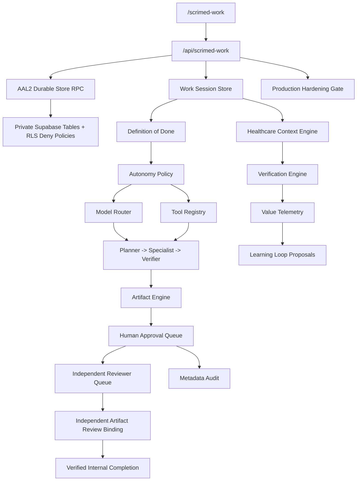

# SCRIMED Work & Intelligence Platform

SCRIMED Work is a synthetic/no-PHI, verification-first control plane for long-running healthcare work sessions. It consolidates workspaces, Definition-of-Done contracts, model and tool routing, multi-agent orchestration, healthcare context retrieval, approval gates, artifact generation, disabled schedule definitions, voice-session simulation, learning-loop proposals, rollback metadata, audit records, and value telemetry.

## Safety Boundary

SCRIMED Work does not authorize live PHI, autonomous clinical care, diagnosis, treatment, prescribing, patient outreach, payer submission, EHR writeback, final imaging interpretation, production connector approval, certification claims, customer go-live, or external model calls.

Consequential clinical, financial, privacy, identity, scheduling, write, and external-communication actions are disabled by default and must fail closed unless future approved authentication, authorization, CSRF, rate limiting, durable storage, and human approval controls are configured.

## Architecture



## Core Modules

- `app/lib/scrimed-work/types.ts`: workspace, session, artifact, provider, telemetry, and API envelope types.
- `schemas.ts`: lightweight validation with PHI/token-like field rejection.
- `workspaceRegistry.ts`: domain views for Clinical Work, Executive Work, Research Work, Operations Work, and SCRIMED Studio.
- `workSessionStore.ts`: deterministic in-memory adapter for synthetic public examples only; protected tenant sessions are never copied into this public process map.
- `durableStore.ts`: protected Supabase RPC adapter for AAL2-gated session, artifact, status, idempotency, and audit persistence.
- `sessionLifecycle.ts`: explicit session state machine, transition preconditions, independent-review controls, cancellation propagation, and deterministic decision hashes.
- `productionHardening.ts`: machine-readable production-hardening gate separating evidence-ready controls from operator-required release steps.
- `modelRouter.ts`: provider-neutral model selection with privacy, residency, cost, and safety constraints.
- `providerRegistry.ts`: configurable OpenAI-compatible, Anthropic-compatible, local/private, and synthetic no-call adapters.
- `toolRegistry.ts`: least-privilege tools with consequential actions disabled and approval-gated.
- `agentRegistry.ts`: coordinator, clinical-context, interoperability, patient-access, research, RCM, verification, safety, artifact, executive, and reviewer agents.
- `contextEngine.ts`: citation-required hybrid retrieval scaffold with ontology concepts mapped to FHIR previews.
- `verificationEngine.ts`: schema, citation, policy, PHI, loop, budget, rollback, and approval checks.
- `artifactEngine.ts`: JSON/Markdown draft artifacts with citations, verification, review status, and export metadata.
- `artifactReview.ts`: reviewer-only internal disposition policy with separation of duties, database-verifiable reviewer/decision hashes, mandatory verification, and fixed external-use blocks.
- `reviewQueue.ts`: strict parser and bounded-response contract for the tenant-scoped reviewer queue.
- `payerIqHandoff.ts`: strict synthetic PayerIQ packet-to-session adapter for the revenue-cycle workspace.
- `scheduleDefinitions.ts`: disabled-by-default scheduled-work templates.
- `voiceWorkflow.ts`: provider-neutral voice-state simulation with consent and emergency escalation boundaries.
- `learningLoop.ts`: memory-vs-learning correction artifacts requiring review and tests.
- `valueTelemetry.ts`: privacy-safe productivity metrics and botsitting ratio.
- `audit.ts`: deterministic audit hashes, request IDs, trace IDs, and redaction helpers.

## API Routes

Read routes:

- `GET /api/scrimed-work`
- `GET /api/scrimed-work/brief`
- `GET /api/scrimed-work/sessions`
- `GET /api/scrimed-work/sessions/:sessionId`
- `GET /api/scrimed-work/providers`
- `GET /api/scrimed-work/agents`
- `GET /api/scrimed-work/tools`
- `GET /api/scrimed-work/schedules`
- `GET /api/scrimed-work/production-hardening`
- `GET /api/scrimed-work/review-queue` (reviewer-only AAL2, tenant-scoped, metadata-only, audited)

Metadata POST routes:

- `POST /api/scrimed-work/route-model`
- `POST /api/scrimed-work/context/search`
- `POST /api/scrimed-work/voice/simulate`
- `POST /api/scrimed-work/sessions/:sessionId/verify`

Protected write-shaped routes:

- `POST /api/scrimed-work/sessions`
- `POST /api/scrimed-work/sessions/:sessionId/plan`
- `POST /api/scrimed-work/sessions/:sessionId/run`
- `POST /api/scrimed-work/sessions/:sessionId/pause`
- `POST /api/scrimed-work/sessions/:sessionId/resume`
- `POST /api/scrimed-work/sessions/:sessionId/cancel`
- `POST /api/scrimed-work/sessions/:sessionId/approve`
- `POST /api/scrimed-work/sessions/:sessionId/reject`
- `POST /api/scrimed-work/sessions/:sessionId/complete`
- `POST /api/scrimed-work/sessions/:sessionId/artifacts/:artifactId/review`
- `POST /api/scrimed-work/artifacts`
- `POST /api/documentation-before-authorization/scrimed-work-handoff`

Protected reads and writes return fail-closed by default unless the current versioned migration set is attested. Writes additionally require the mutation-only controls below. The shared authorization boundary enforces the same migration policy reported by the production-hardening endpoint, so stale readiness evidence cannot reach a durable RPC.

Protected writes require all of the following:

- `SCRIMED_WORK_PROTECTED_WRITES_ENABLED=true`
- `SCRIMED_WORK_DURABLE_STORE_ENABLED=true`
- `SCRIMED_WORK_MIGRATIONS_VERIFIED=true`
- `SCRIMED_WORK_MIGRATION_EVIDENCE_ID` identifies reviewed, nonsecret migration/RLS/advisor evidence
- `SCRIMED_WORK_MIGRATION_SET_VERSION=20260716184500` binds that evidence to the current ten-migration contract and fails closed when stale
- `SCRIMED_WORK_REVIEW_QUEUE_APPROVAL_MIGRATION_VERIFIED=true`
- `SCRIMED_WORK_REVIEW_QUEUE_APPROVAL_MIGRATION_EVIDENCE_ID` identifies the reviewed two-step queue migration and advisor evidence
- Supabase runtime URL and publishable key are configured server-side
- `SCRIMED_PILOT_INTAKE_PERSISTENCE_TOKEN` is configured server-side for the existing governance RPC gate
- a tenant member bearer token is supplied
- the bearer token verifies as AAL2 with a bound session id
- the operator has `tenant-admin`, `pilot-lead`, or `reviewer` membership for the supplied workspace
- an `idempotency-key` header is present for mutations; authenticated durable reads do not accept mutation authority from that header
- `x-scrimed-workspace-slug`, `workspaceSlug`, or `SCRIMED_WORK_DEFAULT_WORKSPACE_SLUG` identifies the tenant workspace

The ordered local migrations are:

1. `supabase/migrations/20260709193000_scrimed_work_durable_store.sql` creates private SCRIMED Work session, artifact, and audit-event tables with RLS enabled, direct table access revoked, restrictive deny policies, and authenticated public RPC wrappers that delegate to private AAL2 governance functions.
2. `supabase/migrations/20260713160000_scrimed_work_lifecycle_hardening.sql` adds the authoritative transition matrix, row locking, append-only history checks, scoped mutation checks, independent reviewer separation, high-risk clinical reviewer blocking, and a private tenant-scoped transition idempotency ledger.
3. `supabase/migrations/20260713163000_scrimed_work_advisor_index_hardening.sql` adds covering indexes for the artifact tenant, audit tenant, and audit artifact foreign keys identified by the post-migration Supabase performance advisor.
4. `supabase/migrations/20260713210000_scrimed_work_artifact_review_binding.sql` adds the private reviewer ledger, reviewer-only AAL2 RPC, cryptographic identity/decision binding, immutable artifact mutation scope, idempotent review audit evidence, and synchronized artifact/session review state.
5. `supabase/migrations/20260714163930_scrimed_work_reviewer_queue.sql` adds the reviewer-only queue RPC, bounded synthetic/no-PHI metadata, creator exclusion, audited reads, and fixed external-distribution and payer-submission blocks.
6. `supabase/migrations/20260715143000_scrimed_work_review_queue_approval_step.sql` extends the bounded queue to expose awaiting-approval artifacts so a separate reviewer can record session approval before the independent artifact disposition.
7. `supabase/migrations/20260716012403_scrimed_work_artifact_session_binding.sql` transactionally upserts each persisted artifact into its authoritative session payload, validates tenant/workspace/session/artifact identity, and repairs prior synthetic records without changing creator or review history.
8. `supabase/migrations/20260716015159_scrimed_work_approval_evidence_binding.sql` binds an approved reviewer checkpoint into metadata-only verification evidence, records a dedicated audit event, and repairs already-approved synthetic sessions without exposing identities or weakening review policy.
9. `supabase/migrations/20260716030000_scrimed_work_completion_queue.sql` adds the tenant-admin/pilot-lead completion queue, requires independent review and current all-pass verification, audits each read, and keeps external, payer, and EHR authority disabled.
10. `supabase/migrations/20260716184500_scrimed_work_completion_evidence.sql` adds bounded completed-session evidence, deterministic packet hashes, immutable review/completion references, audited reads, and a focused synthetic completion index.

On 2026-07-16, all ten ordered migrations were present on the approved no-PHI target. Post-migration validation confirmed the completion-evidence private/public RPC split, invoker-mode public wrapper, empty function search paths, anonymous execution denial, focused completion index, and constrained audit event. Supabase security advisors reported no migration-specific finding; the existing leaked-password-protection warning remains an external Auth hardening item. This evidence does not authorize live PHI, clinical care, external distribution, production deployment, or customer go-live.

Independent approval is verification evidence only when a required reviewer checkpoint is durably marked approved. The verifier derives a metadata-only evidence identifier from that checkpoint's audit hash, avoids circular "verification proves verification" requirements, and still requires cited source evidence, rollback readiness, no-PHI checks, and a separately authenticated reviewer before internal-use approval.

## Session Lifecycle

Protected transition routes never trust or populate the public in-memory session map. Every protected read, verification request, or mutation re-reads the record through the tenant-scoped durable RPC before evaluating the action. Read and verification routes require AAL2 identity, authorized tenant membership, workspace scope, sensitive-payload screening, and the durable-store flag; they do not require mutation idempotency or the protected-write feature flag. The application and database enforce the same progression:

```text
draft -> planning -> active or awaiting_approval -> verifying -> completed
                   \-> paused -> active
                   \-> failed/cancelled -> rolled_back
```

- Invalid predecessor/target combinations fail closed.
- Repeated requests are accepted only when the durable idempotency ledger confirms the same key, session, action, target, and request fingerprint.
- Status history must be append-only and must identify the action and prior state.
- Session transitions may change only lifecycle-scoped fields.
- The session initiator cannot approve the same session.
- Approval requires the checkpoint role; tenant administration alone is not reviewer authority.
- High-risk clinical-support approval remains blocked until a separately verified clinician-reviewer identity can be bound.
- Artifact approval for internal use requires a separate reviewer, an approved checkpoint, current verification, immutable source content, and a database-recomputed decision hash.
- Artifact review never enables export, external distribution, or payer submission.
- Completion is exposed only as a protected transition and requires a durably reviewed, verification-eligible artifact; it is never autonomous.

## Independent Reviewer Queue

The protected pilot workspace now contains an explicit reviewer console. Queue reads require a fresh AAL2 session and the exact `reviewer` membership role. The application and database independently enforce tenant scope and exclude sessions or artifacts created by the current reviewer.

The tenant-admin review-preparation control creates one bounded synthetic/no-PHI session and artifact, advances it to `awaiting_approval`, proves creator self-approval fails closed, and stops. The reviewer queue then exposes two distinct human actions: first `Approve Session for Review`, which advances the session to `verifying`; then the artifact disposition. Failed or incomplete preparation is cancelled automatically where the authoritative lifecycle permits it. No bearer token is exported from the browser.

The queue returns at most 50 records and only exposes artifact identifiers, type, synthetic title, workspace domain, risk, review state, approval readiness, verification metadata, a one-way creator identity hash, and timestamps. It never returns raw artifact content, source documents, prompts, connector payloads, patient data, credentials, or free-text reviewer notes. Every queue load records `artifact-review-queue-viewed` evidence, and each approved/changes-requested/rejected disposition continues through the existing durable review RPC. A database trigger keeps the separately persisted artifact row synchronized with the session artifact collection, so policy evaluation and durable review bind to the same stable artifact identifier.

“Approved” means internal synthetic use only. It does not permit external distribution, payer submission, EHR writeback, patient outreach, clinical action, production connectors, certification claims, or customer activation.

## Verified Completion Queue

The protected pilot workspace includes a separate tenant-admin/pilot-lead completion queue. It lists only tenant-scoped sessions that are still `verifying`, contain bound independent-approval evidence, have an `approved_for_internal_use` artifact disposition, and carry a current 100% mandatory verification result. Reviewer and observer memberships are denied at both the application and database layers.

Selecting `Verify and Complete Internal Work` does not trust stored readiness alone. The application requests a fresh server-side verification result and requires `allPass=true`, `eligibleForCompletion=true`, and no failed criteria before it submits the idempotent completion transition. The lifecycle route recomputes verification again against authoritative durable state before recording `completed`. Every queue read and lifecycle transition is audited.

Completion means only that the synthetic internal work contract passed its bounded evidence gates. It does not authorize export, external distribution, payer submission, EHR writeback, clinical action, production connectors, certification claims, customer go-live, or production deployment.

### Completed Internal Evidence

The same protected control exposes a distinct `mode=evidence` read for tenant admins and pilot leads. It returns only completed synthetic/no-PHI sessions whose latest artifact has independent reviewer separation, an `approved_for_internal_use` disposition, current all-pass verification, bound reviewer evidence, and an immutable completion audit event.

Each row contains bounded identifiers, review and completion event IDs, the database-verified review decision hash, the lifecycle decision hash, timestamps, and a deterministic SHA-256 evidence packet hash. It never returns artifact content, session payloads, prompts, reviewer identity, tenant identifiers, raw audit metadata, or connector data. Every read records `session-completion-evidence-viewed`, and the response fixes internal-use-only, external-distribution, payer-submission, and EHR-writeback controls in both SQL and TypeScript validation.

## Production Hardening Gate

### AAL2 browser-session verification

The protected pilot access surface includes a bounded eleven-check SCRIMED Work verifier. It uses the active tenant AAL2 browser session directly and never exports the bearer token to a terminal, CI log, page field, download, or audit record. The verifier proves unauthenticated fail-closed behavior, durable create and replay, authoritative tenant-scoped read, verification evidence with the human-review completion gate held, lifecycle transition and replay, invalid-transition denial, artifact metadata persistence, and cancellation cleanup.

Every run is synthetic metadata only. It stops when routes, durable storage, authorization, or operator flags are unavailable; it does not downgrade to an unapproved provider or in-memory success path. A created verification session is cancelled in a `finally` cleanup path while its append-only evidence remains available for review.

### Two-Identity AAL2 Canary

The release canary proves the complete internal lifecycle with two genuinely distinct people and Supabase Auth users. A tenant-admin or pilot-lead creates the synthetic session and artifact. That operator is denied access to the reviewer-only queue and cannot self-approve. A separately enrolled `reviewer` approves the session, observes the bounded metadata-only queue item, binds an internal-use-only artifact review, and leaves completion to mandatory verification. Completion never authorizes external distribution, payer submission, EHR writeback, clinical action, connector activation, certification, or customer go-live.

Use a separate business email controlled by the reviewer. A plus-address alias, a second token for the same Auth user, or the same person in another browser profile does not satisfy independent review evidence.

1. Have the reviewer enroll through the approved SCRIMED sign-in flow and configure AAL2 MFA.
2. As tenant admin, create a reviewer invitation from `/pilot-workspace/access`.
3. Activate the invitation only after the reviewer Auth identity exists. Invitation records do not send email or create Auth users.
4. Keep the operator and reviewer signed in through separate browser profiles so one session cannot overwrite the other.
5. Capture each short-lived token through the hidden terminal prompt. The helper writes only to gitignored `.env.local` with mode `0600` and never prints the token.

```bash
npm run smoke:aal2:token -- --prompt-token --token-env SCRIMED_BEARER_TOKEN --required-role tenant-admin --write-env-local
npm run smoke:aal2:token -- --prompt-token --token-env SCRIMED_REVIEWER_BEARER_TOKEN --required-role reviewer --write-env-local
npm run smoke:scrimed-work:durable-store-preflight:strict
npm run smoke:scrimed-work:two-identity:strict
```

The strict canary checks distinct JWT `sub` and `session_id` claims locally, then relies on protected APIs for signature, AAL2, tenant membership, role, and lifecycle verification. Output is limited to synthetic record IDs, audit IDs, and one-way fingerprints. After a reviewed successful run, bind the retained evidence with `SCRIMED_WORK_TWO_IDENTITY_CANARY_VERIFIED=true` and a nonsecret `SCRIMED_WORK_TWO_IDENTITY_CANARY_EVIDENCE_ID`; never retain the bearer values as release evidence.

`GET /api/scrimed-work/production-hardening` returns a no-secret readiness gate for SCRIMED Work. It reports:

- evidence-ready safety, Definition-of-Done, and verification controls;
- operator-required protected-write, durable-store, Supabase runtime, server-token, AAL2, workspace, migration, and canary gates;
- strict smoke commands;
- next operator actions;
- retained no-PHI, no-autonomous-care, no-EHR-writeback, no-payer-submission, no-certification, and no-customer-go-live boundaries.

The gate intentionally does not apply migrations, verify production readiness, expose credential values, or authorize buyer-facing protected mutations.

## Feature Flags

- `SCRIMED_WORK_ENABLED`: read-only control plane enabled by default.
- `SCRIMED_MULTI_AGENT_ENABLED`: synthetic orchestration metadata enabled by default.
- `SCRIMED_MODEL_ROUTER_ENABLED`: routing metadata enabled by default.
- `SCRIMED_CONTEXT_ENGINE_ENABLED`: context retrieval scaffold enabled by default.
- `SCRIMED_ARTIFACT_ENGINE_ENABLED`: draft artifact scaffolding enabled by default.
- `SCRIMED_SCHEDULES_ENABLED`: disabled by default.
- `SCRIMED_VOICE_SIMULATION_ENABLED`: enabled for simulation only.
- `SCRIMED_LEARNING_LOOP_ENABLED`: learning proposal metadata enabled by default.
- `SCRIMED_CONSEQUENTIAL_ACTIONS_ENABLED`: disabled by default.
- `SCRIMED_WORK_PROTECTED_WRITES_ENABLED`: disabled unless protected SCRIMED Work mutation routes are explicitly authorized.
- `SCRIMED_WORK_DURABLE_STORE_ENABLED`: disabled unless the Supabase durable-store migration is applied and authenticated smoke passes.
- `SCRIMED_WORK_MIGRATIONS_VERIFIED`: disabled until the target migration history, RLS, grants, and advisors are reviewed.
- `SCRIMED_WORK_MIGRATION_EVIDENCE_ID`: required nonsecret identifier linking the environment to its reviewed migration evidence.
- `SCRIMED_WORK_MIGRATION_SET_VERSION`: must equal `20260716184500` so stale migration evidence cannot satisfy the current ten-migration release gate.
- `SCRIMED_WORK_REVIEW_QUEUE_APPROVAL_MIGRATION_VERIFIED`: disabled until the two-step reviewer queue migration is applied and independently checked.
- `SCRIMED_WORK_REVIEW_QUEUE_APPROVAL_MIGRATION_EVIDENCE_ID`: required nonsecret identifier linking the two-step queue migration to reviewed grant, function, and advisor evidence.
- `SCRIMED_REVIEWER_BEARER_TOKEN`: short-lived local-only reviewer AAL2 token used by the strict two-identity canary; never deploy or log it.
- `SCRIMED_WORK_TWO_IDENTITY_CANARY_VERIFIED`: true only after the protected two-person lifecycle succeeds and its evidence is reviewed.
- `SCRIMED_WORK_TWO_IDENTITY_CANARY_EVIDENCE_ID`: nonsecret identifier linking release provenance to that reviewed canary evidence.
- `SCRIMED_WORK_DEFAULT_WORKSPACE_SLUG`: optional fallback workspace slug for protected SCRIMED Work smoke tests.

## Local Validation

Run:

```bash
npm run smoke:scrimed-work
npm run test:scrimed-work:lifecycle
npm run test:scrimed-work:artifact-review-policy
npm run test:scrimed-work:review-queue-policy
npm run test:scrimed-work:review-preparation-policy
npm run test:scrimed-work:two-identity-policy
npm run test:scrimed-work:production-hardening-policy
npm run smoke:scrimed-work:durable-store-preflight
npm run smoke:scrimed-work:authenticated
npm run smoke:scrimed-work:two-identity
npm run typecheck
npm run lint
npm run test:nonsecret
npm run build
node scripts/check-generated-integrity.mjs
git diff --check
```

For the protected non-production durable-store operator path, use:

```bash
npm run smoke:scrimed-work:durable-store-preflight:strict
npm run smoke:scrimed-work:strict
npm run smoke:scrimed-work:two-identity:strict
```

The preflight validates all ten ordered migration contracts, RLS/deny-policy posture, lifecycle matrix, transition and artifact-review ledgers, the bounded two-step reviewer queue, the operator-only completion queue and completion-evidence history, authoritative locking, append-only history, reviewer separation, database-verifiable review hashes, immutable artifact scope, audited reads, external-use blocks, `security invoker` public wrappers, AAL2 token shape, required environment variables, feature flags, workspace slug, and no-secret output behavior. It does not apply migrations, mutate Supabase, verify production, or authorize live clinical workflows.

Local token inspection is explicitly reported as `signature=not-verified-local-preflight`. Only a successful Supabase Auth check or protected API request may promote that evidence to a verified state. Operator logs redact JWT-shaped values, bearer credentials, named access or refresh tokens, API keys, and Supabase-style secrets.

## Known Limitations

- Read-only public views remain synthetic. Protected durable reads and verification require an AAL2 bearer session, authorized workspace membership, workspace scope, and the durable-store flag. Protected writes additionally require the server runtime token, mutation idempotency key, protected-write flag, and reviewed migration evidence.
- The existing membership model has tenant-admin, pilot-lead, reviewer, and observer roles but no verified clinician credential binding. High-risk clinical approval therefore remains blocked rather than treating a generic reviewer as a clinician.
- Completion and its evidence history remain internal synthetic lifecycle evidence. They are not release, distribution, clinical, regulatory, connector, or customer go-live authority.
- A complete PayerIQ lifecycle needs two distinct AAL2 identities: an authorized initiator and a separate `reviewer` member. One account cannot satisfy separation of duties.
- Provider adapters do not call external models and require future secret-managed configuration, legal/privacy review, and budget controls.
- Schedules are definitions only; no uncontrolled background scheduler is introduced.
- Voice workflows are simulation-only and never store raw audio by default.
- FHIR previews are read-only and do not write to an EHR.

## Next Production-Hardening Step

Apply and review the completion-evidence migration in the approved no-PHI target, then run an authenticated tenant-admin read against `mode=evidence` and retain only its safe audit-event ID and evidence packet hash. Keep buyer-facing export disabled until a separate recipient, purpose, legal, and release-authority workflow approves sharing. Externally reviewed clinician-identity binding remains mandatory before any high-risk clinical approval path is considered.
