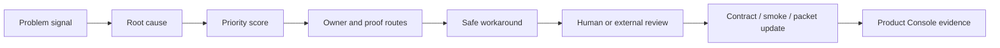

# SCRIMED Strategic Problem Resolution Engine

SCRIMED Strategic Problem Resolution Engine is a metadata-only operating layer for turning constraints into owner-bound execution. It ranks problems, names root causes, assigns owners, maps proof routes, recommends safe workarounds, and blocks unsafe actions before they become informal exceptions.

## Why It Matters

SCRIMED is growing into a broad healthcare intelligence operating system. The platform needs a repeatable way to:

- separate synthetic/demo readiness from clinical production readiness;
- convert buyer interest into scoped, margin-safe delivery;
- keep international expansion claims safe;
- prevent route, release, and navigation drift;
- answer interoperability questions without authorizing live connectors;
- package investor proof without overclaiming;
- accelerate automation while keeping humans in control.

## Safety Boundary

This layer does not authorize live PHI, autonomous clinical care, diagnosis, treatment, prescribing, patient outreach, payer submission, EHR writeback, production connector approval, production deployment, legal approval, certification claims, securities claims, valuation assurance, revenue guarantees, profit guarantees, or customer go-live.

## Operating Loop

## Validation

- `npm run smoke:strategic-problem-resolution`
- `npm run test:nonsecret`
- `npm run smoke:public`
- `npm run typecheck`
- `npm run lint`
- `npm run build`
